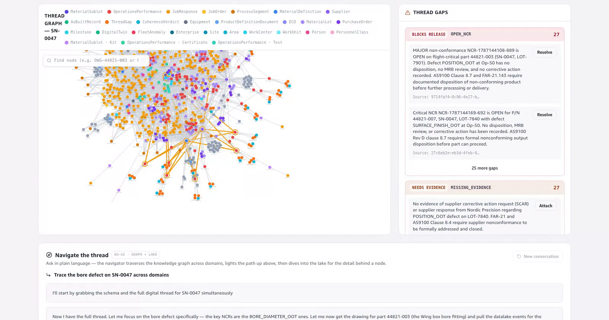
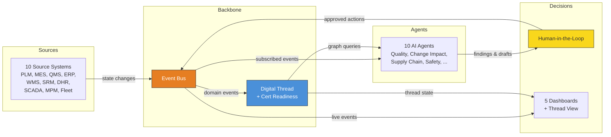
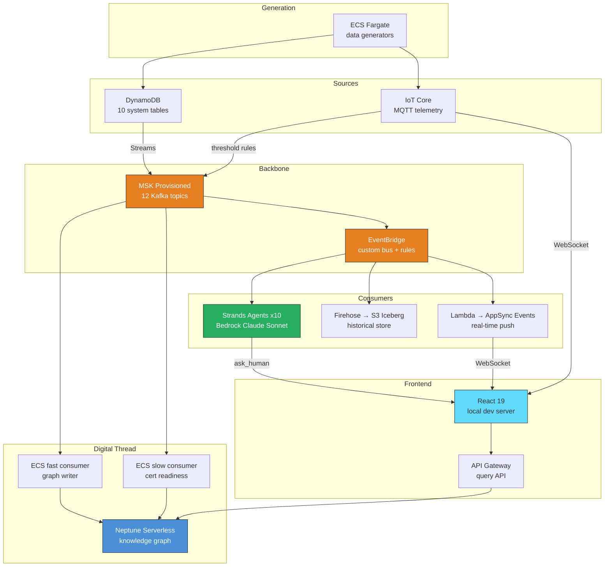

# Aerospace Events Agents Digital Thread

> "One Defect. Five Domains. Ten Minutes."

<p align="center">
  <a href="docs/specs/thread-navigator-demo/README.md">
    
  </a>
  <br>
  <sub>Ask the thread navigator to trace a defect: it walks the ISA-95 knowledge graph, lights the cross-domain path on the full thread and pulls the evidence from the lake.
  <a href="docs/specs/thread-navigator-demo/video/thread-navigator-demo.mp4">80 s video</a></sub>
</p>

> **Sample code — not for production.** This is sample code for non-production usage. Work with
> your security and legal teams to meet your organizational security, regulatory, and compliance
> requirements before deployment. Licensed under **MIT-0** (see [`LICENSE`](LICENSE)); bundled
> third-party content is listed in [`THIRD-PARTY-LICENSES.md`](THIRD-PARTY-LICENSES.md).
>
> All data, entities, and identifiers in this sample are **fictitious**: the ARES-1 program, its
> sites, suppliers and people are invented.

A single quality event on the shop floor cascades through every layer of the architecture live — tracing to a supplier lot, identifying at-risk units, flagging certification gaps, and surfacing fleet screening recommendations — all while keeping humans in control of every consequential decision.

The knowledge graph is fully **ISA-95:2018 (IEC 62264)** aligned — vocabulary,
hierarchy, plan/actual split, Personnel, ProcessSegments, plus an OWL+SPARQL
RDF dual-write for ontology-aware integration. See [`docs/specs/isa95-walkthrough.md`](docs/specs/isa95-walkthrough.md)
for a screenshot + terminal-evidence tour, or the short video at
[`docs/specs/walkthrough/video/demo.mp4`](docs/specs/walkthrough/video/demo.mp4).

## What it looks like

<table>
  <tr>
    <td width="33%" valign="top">
      <a href="docs/specs/thread-demo/README.md"></a>
      <br><sub><b>Digital thread</b> — one graph across engineering, manufacturing, quality, supply chain and fleet, scored for certification readiness.</sub>
    </td>
    <td width="33%" valign="top">
      <a href="docs/specs/agent-observability-demo/README.md"></a>
      <br><sub><b>Agent trace</b> — every invocation, A2A call, human question and finding on one correlation id.</sub>
    </td>
    <td width="33%" valign="top">
      <a href="docs/specs/hitl-demo/README.md"></a>
      <br><sub><b>Humans decide</b> — agents prepare the options; suspension, SCAR and quarantine wait for a person.</sub>
    </td>
  </tr>
  <tr>
    <td width="33%" valign="top">
      <a href="docs/specs/scada-demo/README.md"></a>
      <br><sub><b>Live shop floor</b> — 1 Hz machine telemetry over IoT Core MQTT, threshold rules feeding the same event backbone.</sub>
    </td>
    <td width="33%" valign="top">
      <a href="docs/specs/datalake-analytics-demo/README.md"></a>
      <br><sub><b>Datalake analytics</b> — every event lands in Iceberg; Athena answers the dashboards and the agents.</sub>
    </td>
    <td width="33%" valign="top">
      <a href="docs/specs/hero-demo/README.md"></a>
      <br><sub><b>Interactive architecture</b> — click any element to see what it connects to; the same 15 CDK stacks you deploy.</sub>
    </td>
  </tr>
</table>

Twelve recorded demos, each with a video and a walkthrough: [`docs/specs/DEMOS.md`](docs/specs/DEMOS.md).

## Program Context

| Field | Value |
|-------|-------|
| Program | ARES-1 |
| Product | Commercial aircraft wing box sub-assembly |
| Active serial | S/N 0047 (in production) |
| Delivered serials | S/N 0031-0046 (in-service) |
| Problem defect | Bore diameter out of tolerance (BORE_DIAMETER_OOT) |
| Supplier under scrutiny | Titan Forge (Lot-7731) |

## Functional Architecture



## Technical Architecture (AWS)



## Prerequisites

- An AWS account and credentials (`aws sts get-caller-identity` succeeds). Set `AWS_PROFILE` to your profile, or omit it to use the default credential chain. The app is pinned to **eu-west-1**.
- **Node.js 20.19+ or 22.12+** (required by Vite 7) and npm. AWS CDK v2 is installed by `npm ci` in `src/infra/`.
- **Docker** running — the deploy builds arm64 (AgentCore) and amd64 (ECS Fargate) images; on Apple Silicon the amd64 builds use QEMU emulation.
- **Python 3.12** for the seed and utility scripts, with `boto3` and `rdflib` (a venv is recommended):
  ```bash
  python3 -m venv .venv && source .venv/bin/activate && pip install boto3 rdflib
  ```
- Amazon Bedrock model access in the account for **`global.anthropic.claude-sonnet-4-6`** (cross-region inference profile; used by every agent and by text-to-SQL) and **Claude Haiku 4.5** (the optional `scripts/generate-scenario.py` only).
- **AWS Agent Registry** available in the account: the agents register there for A2A discovery.

## Deploy

CDK owns all infrastructure — one `cdk deploy --all`. Run from `src/infra/`.

```bash
export AWS_PROFILE=<your-profile> AWS_REGION=eu-west-1   # AWS_PROFILE optional
./scripts/fetch-connector.sh                 # download + checksum-verify the pinned MSK Connect plugin into .build/plugins/
cd src/infra && npm ci
npx cdk bootstrap                            # first time in the account/region
npx cdk deploy --all --require-approval never --concurrency 1
```

Notes:
- **Cost** — the sample runs always-on infrastructure from the first deploy: MSK Provisioned (2 × kafka.t3.small) and MSK Connect (1 MCU), Neptune Serverless (min 1 NCU), a NAT gateway, three Fargate services (the demo generators start at desired count 1) and 12 AgentCore runtimes. Expect on the order of a few hundred USD per month while it is up: run `./scripts/stop-generators.sh` between demos and `cdk destroy --all` when you are done.
- **First deploy takes ~60–90 min** — MSK (~25 min) and Neptune (~15 min) dominate, plus arm64/amd64 container image builds. `--concurrency 1` deploys one stack at a time so a failure doesn't cascade.
- Every resource is tagged (`Project` / `Environment` / `ManagedBy`) and the VPC has flow logs to CloudWatch.
- **CORS** — the query API only answers browser origins on an allowlist (default `http://localhost:5173,http://localhost:5174`, the local Vite dev server). Serving the frontend elsewhere? Pass `-c frontendOrigins=https://your.origin` to `cdk deploy`.
- **API Gateway** stage is throttled (50 rps / 100 burst) and writes JSON access logs to CloudWatch (30-day retention).
- **Before production** — this sample keeps `RemovalPolicy.DESTROY`, `autoDeleteObjects` and Neptune `deletionProtection: false` so `cdk destroy` tears everything down. A production deployment should flip those to retain, add AWS WAF in front of API Gateway, enable DynamoDB point-in-time recovery, use customer-managed KMS keys, route Lambda/ECS traffic to AWS services over VPC endpoints instead of the NAT gateway, pin a numbered Bedrock Guardrail version instead of `DRAFT`, and give the human-facing consoles (AG-UI analytics, thread navigator) their own guardrail with a stricter prompt-attack strength than the agent-to-agent runtimes.

## Teardown

Everything is destroyable — S3 buckets auto-delete their objects, Neptune has deletion protection off, and no resource is retained on delete:

```bash
export AWS_PROFILE=<your-profile> AWS_REGION=eu-west-1
cd src/infra && npx cdk destroy --all
```

The CDK bootstrap stack, its asset bucket/ECR images and CloudWatch log groups without a retention policy are left behind by design.

To wipe demo **data** without tearing down the infrastructure (graph + DynamoDB + Iceberg), use `./scripts/reset-demo.sh` instead.

## Project Structure

```
aerospace-events-agents-digital-thread/
  config/
    agents/                   # 10 Strands agent YAML configs
    master-data/              # ISA-95 hierarchy + personnel + ProcessSegment seeds (L2)
    ontology/                 # IOF Core/ProductionPlanning + hsu-aut DINEN62264-2 (L3)
    schema/b2mml/V7.00.00/    # MESA B2MML XSDs (L3)
  docs/specs/                 # Migration plan, walkthrough, ontology provenance
    walkthrough/              # Screenshots + query outputs
    walkthrough/video/        # Demo MP4 + frame PNGs
  src/
    agents/tools/             # Strands agent tools (query_graph, query_sparql, ask_human, …)
    consumers/
      fast-consumer/          # MSK → Neptune handlers (Gremlin + RDF dual-write)
      slow-consumer/          # Cert Readiness Agent
    frontend/                 # React app (runs locally)
    generators/               # Demo data generators (ECS Fargate)
    infra/                    # CDK stacks (TypeScript)
    lambdas/                  # Lambda function source
  tests/
  scripts/                    # reset-demo.sh, seed-baseline.py, seed-master-data.py,
                              #   import-ontology.py, replay-dlq.py, …
  CLAUDE.md                   # AI assistant instructions
  package.json
  tsconfig.json
  cdk.json
```

## ISA-95:2018 Migration

The knowledge graph implements ISA-95 (IEC 62264) in three levels. Design notes:
[`docs/specs/isa95-migration.md`](docs/specs/isa95-migration.md). Visual +
terminal evidence: [`docs/specs/isa95-walkthrough.md`](docs/specs/isa95-walkthrough.md).
Video: [`docs/specs/walkthrough/video/demo.mp4`](docs/specs/walkthrough/video/demo.mp4).

| Level | What it covers |
|-------|----------------|
| 1 — vocabulary | **Vocabulary**: 16 ad-hoc node labels + 24 edge verbs renamed to ISA-95 (`Part` → `MaterialDefinition`, `WorkOrder` → `JobResponse`, `RAISED_AGAINST` → `appliesTo`, …). `subtype` property disambiguates collapsed concepts (NCR/Cert/Test → `OperationsPerformance`; Kit/Serial → `MaterialSublot`). |
| 2 — structure | **Structure**: `Enterprise → Site → Area → WorkCenter → WorkUnit` hierarchy, 23 `Person` + 6 `PersonnelClass` master data, source-side JobOrder/JobResponse split (`requestsExecution` edge), 25 `ProcessSegment` recipe steps, `query_hierarchy` and `query_plan_vs_actual` Lambda ops, DHR signing chain (`signedBy`/`completedBy`). |
| 3 — ontology + RDF | **Ontology + RDF**: 4,701 TBox triples imported from MIT-licensed IOF Core + ProductionPlanning + hsu-aut DINEN62264-2. Live ABox dual-write from the fast consumer via SPARQL UPDATE. New Lambda ops `execute_sparql` / `sparql_update`, Strands tool `query_sparql`. B2MML V7.00.00 XSDs vendored, happy-path serializer for NCR / WO_STARTED / OP_COMPLETE. |

## Run the demo

Assumes the stacks are deployed (see [Deploy](#deploy)) and the Python venv with
`boto3` + `rdflib` is active (see [Prerequisites](#prerequisites)). The Cognito demo
user is created + given a password out-of-band, e.g.:
`aws cognito-idp admin-create-user --user-pool-id <VITE_USER_POOL_ID> --username demo@ares1.test --message-action SUPPRESS` then
`aws cognito-idp admin-set-user-password --user-pool-id <VITE_USER_POOL_ID> --username demo@ares1.test --password '<password>' --permanent`. The pool enforces 12+ characters with an uppercase letter, a digit and a symbol.

```bash
export AWS_PROFILE=<your-profile> AWS_REGION=eu-west-1
./scripts/reset-demo.sh --no-restart            # wipe state, generators stopped
python3 scripts/seed-baseline.py                # 90-day seed history (~1100 items)
python3 scripts/seed-master-data.py             # ISA-95 hierarchy + personnel + segments (L2)
python3 scripts/import-ontology.py              # IOF + hsu-aut into Neptune RDF (L3, idempotent)
./scripts/start-generators.sh                   # live events
./scripts/generate-env.sh && (cd src/frontend && npm ci && npm run dev)
# Open http://localhost:5173 and sign in (Cognito user demo@ares1.test).
```

In the app, open **Control** (`#/demo-control`) and inject a scenario: **NCR Cluster — Titan Forge**
triggers the headline cascade (three CRITICAL NCRs → Conformance Guardian → A2A hand-offs → a
human decision on the Quality dashboard). The twelve recorded walkthroughs are indexed in
[`docs/specs/DEMOS.md`](docs/specs/DEMOS.md), starting with the [hero demo](docs/specs/hero-demo/README.md).

Verify the ISA-95 vocabulary landed:

```bash
aws lambda invoke --function-name aerospace-neptune-query \
  --cli-binary-format raw-in-base64-out \
  --payload '{"operation":"execute_gremlin","parameters":{"gremlin":"g.V().groupCount().by(label())"}}' \
  /tmp/out.json && cat /tmp/out.json | jq -r '.body | fromjson | .[0]'
```

See [`docs/specs/isa95-walkthrough.md`](docs/specs/isa95-walkthrough.md) §8–§11
for the canonical Gremlin + SPARQL evidence queries (counts, hierarchy
traversal, `query_plan_vs_actual`, signing chain, OWL class count).

## Key Design Principles

1. **Uniform Source System Pattern** — Every system: DynamoDB -> Streams -> Lambda -> MSK
2. **Agents Prepare, Humans Decide** — Agents classify, draft, traverse. Humans approve.
3. **Graph as Relationship Layer** — Neptune holds relationships, not data. Source systems are the system of record.
4. **Policy at Infrastructure Level** — Tool guards enforce regulated-industry constraints. Safety is not prompt-dependent.
5. **Full Audit Trail** — Every event, agent action, HITL decision in Iceberg.
6. **Managed Agent Discovery** — Agents find and call each other through the **AWS Agent Registry** (Bedrock AgentCore). One A2A record per agent; peers are discovered by *semantic* search and ARNs resolved from registry records — no hand-maintained registry file.

## Security

See [CONTRIBUTING.md](CONTRIBUTING.md#security-issue-notifications) for how to report a security issue.

## License

This sample is licensed under MIT-0 (see [`LICENSE`](LICENSE)). Bundled third-party content and its
licenses are listed in [`THIRD-PARTY-LICENSES.md`](THIRD-PARTY-LICENSES.md). The Business To
Manufacturing Markup Language (B2MML) is used courtesy of MESA International.
