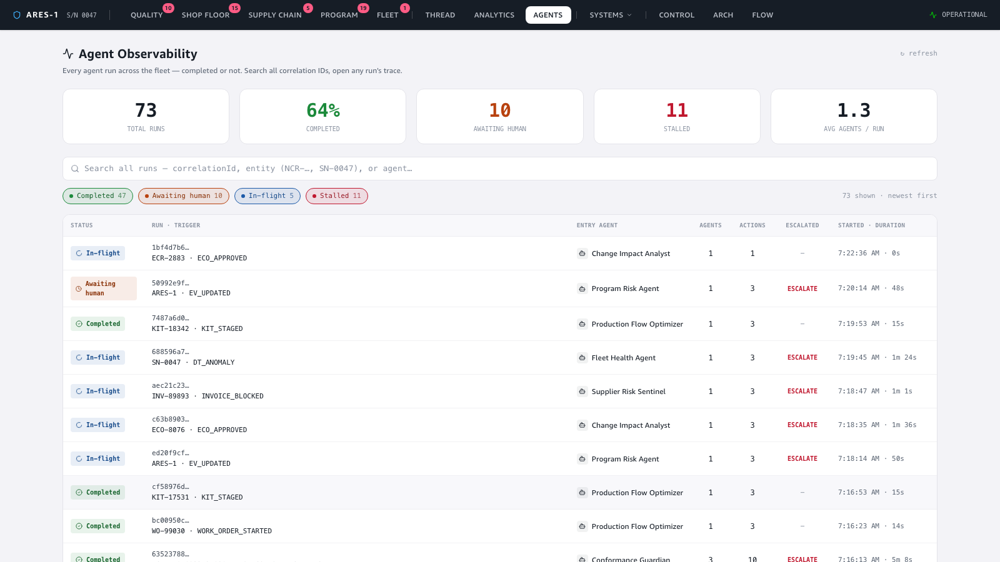
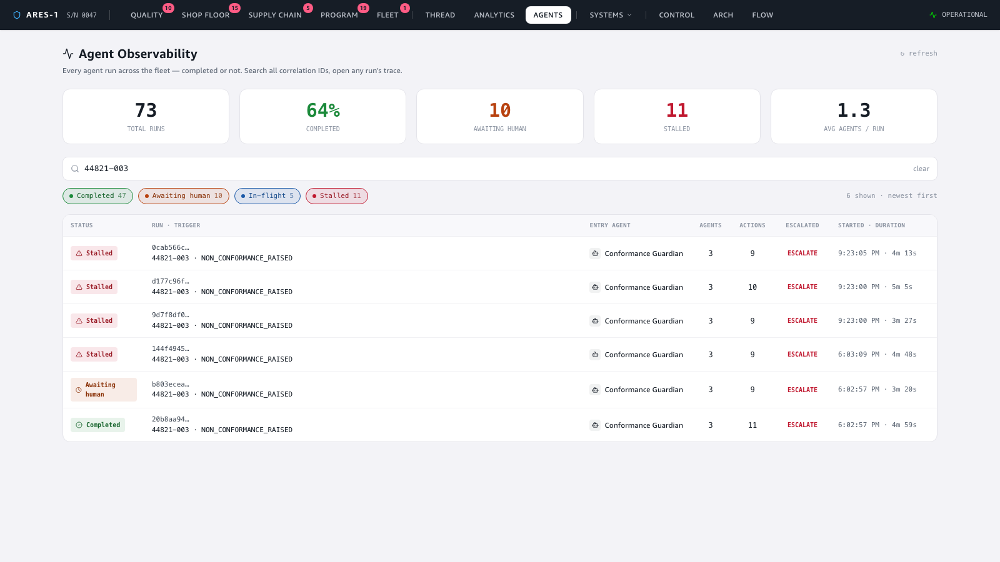

# Demo — Agent Observability: every run, searchable; open any trace

**Story:** the trace drawer already shows one agent cascade beautifully — but only if you
*already have* the correlationId (you reach it from a dashboard finding). This page closes
that gap: a searchable list of **every agent run across the fleet — completed or not** —
where clicking a run opens the **exact same trace drawer, unchanged**. Fleet-wide agent
observability, built by reusing what already existed + one new "list runs" query.

🎬 **Video:** [`video/agent-observability-demo.mp4`](video/agent-observability-demo.mp4) (~18s continuous screen recording)

---

## 1. Every run, one list — with derived status

The Agents page (`#/agent-observability`) opens on a stat row (total runs, % completed,
awaiting-human, stalled, avg agents/run) and a table of **every run, newest first**. Each
row is one correlationId, summarized: **status badge**, the trigger entity (NCR-…, SN-0047,
WO-…, ARES-1), the entry agent, #agents involved, #actions, whether it escalated, and
started + duration. Status is **derived from the action stream** — no new field written:

- **Completed** — the run reached `stop_session`
- **Awaiting human** — it ends on `ask_human` (paused for a decision)
- **In-flight** — invoked recently, no stop yet
- **Stalled** — no stop, and gone stale

## 2. Search across ALL runs

The gap this fills: today the trace drawer only fetches a correlationId you already know.
Here a single search box queries **every** run — by correlationId, entity, or agent. Typing
`44821-003` narrows the whole fleet to the runs touching that part; status chips
(Completed / Awaiting human / In-flight / Stalled) filter alongside it.

## 3. Click a run → the existing trace drawer (unchanged)

The payoff, and the point of the design: clicking any row opens **the same `TraceDrawer`
the dashboards open** — no changes. Multi-agent runs render as per-agent swimlanes;
single-agent runs as a flat timeline. Here a Conformance Guardian run: `AGENT INVOKED`
(NON_CONFORMANCE_RAISED) → `ASKED HUMAN` (bore-diameter OOT disposition) → `CALLED AGENT`
(→ agent4-supplier-risk, the A2A hop) → `FINDING PUBLISHED` (ESCALATE).

---

### Live evidence (not just the UI)
Captured against the live deployed pipeline (eu-west-1), after starting the generators and
injecting an `ncr-cluster` so the fleet was actively running:

| Signal | Value |
|---|---|
| Runs surfaced | **46** (30 completed · 4 awaiting human · 7 in-flight · 5 stalled) |
| Distinct agents seen | Conformance Guardian, Supplier Risk, Production Flow, Program Risk, DHR Completeness, Certification, Change Impact, … |
| Multi-agent (A2A) runs | e.g. Conformance Guardian → agent4-supplier-risk, 3 agents / 9 actions |
| Backend | one new `list-runs` op on the `aerospace-hitl-query` Lambda (scans `agent-trace`, groups by correlationId, derives status) |
| Drawer | the **existing** `TraceDrawer` component — zero changes |

### How it was captured
Frontend run locally (`npm run dev`), driven with Playwright as one continuous recording.
The runs are real: generators live + an injected `ncr-cluster` drove agent1 → A2A → HITL,
and organic generator events fired the other agents; all wrote to the `agent-trace` table
that `list-runs` reads. The only new code is this page + the `list-runs` query — the trace
drawer, swimlane, and trace schema are untouched. See the
[`record-demo`](../../.claude/skills/record-demo/SKILL.md) skill.
