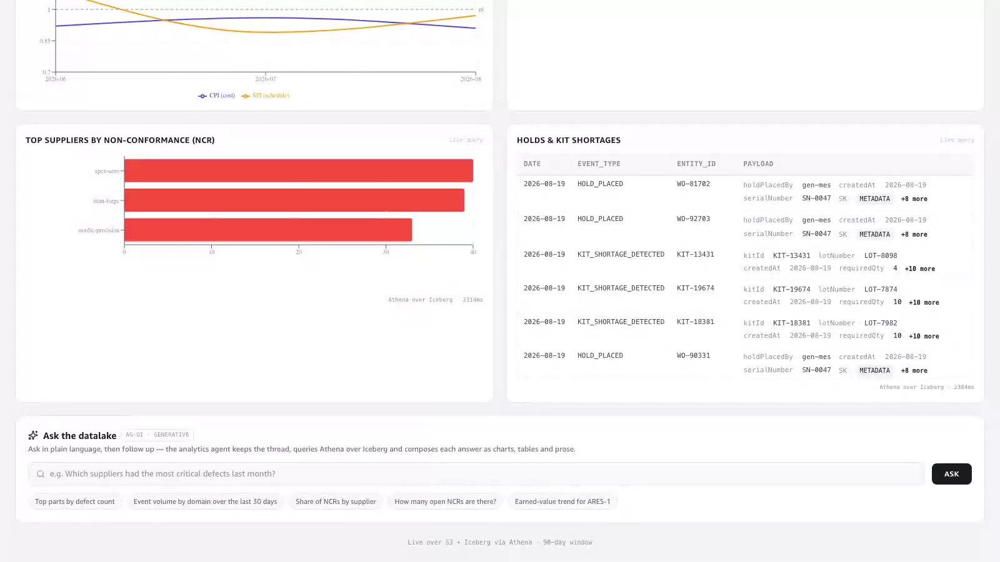
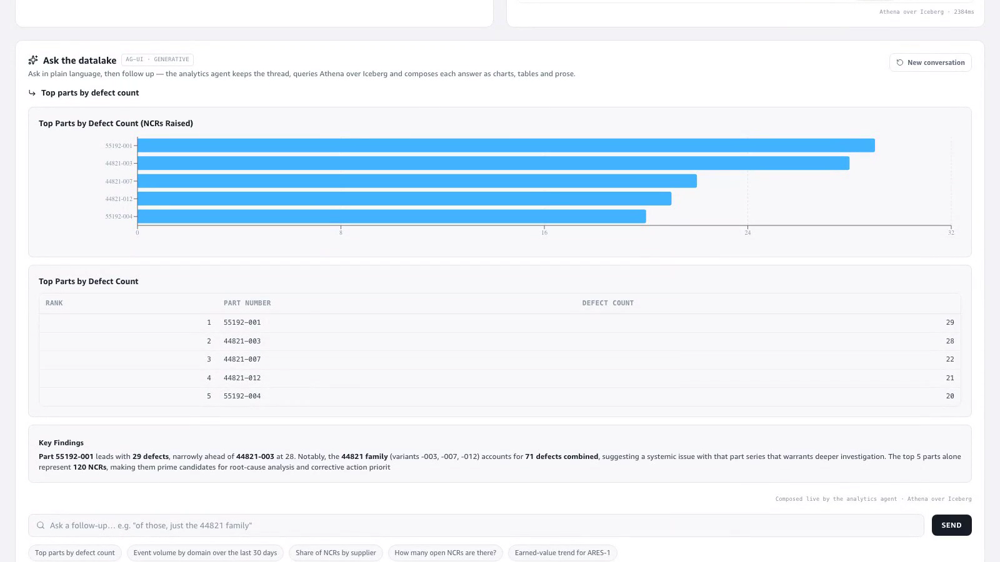
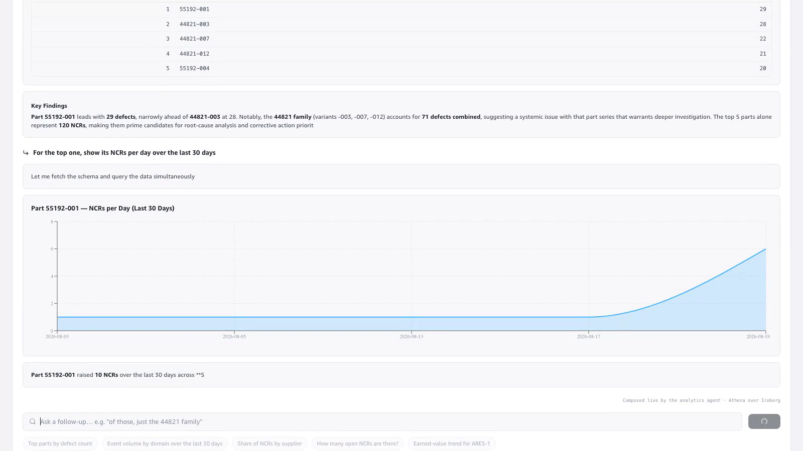
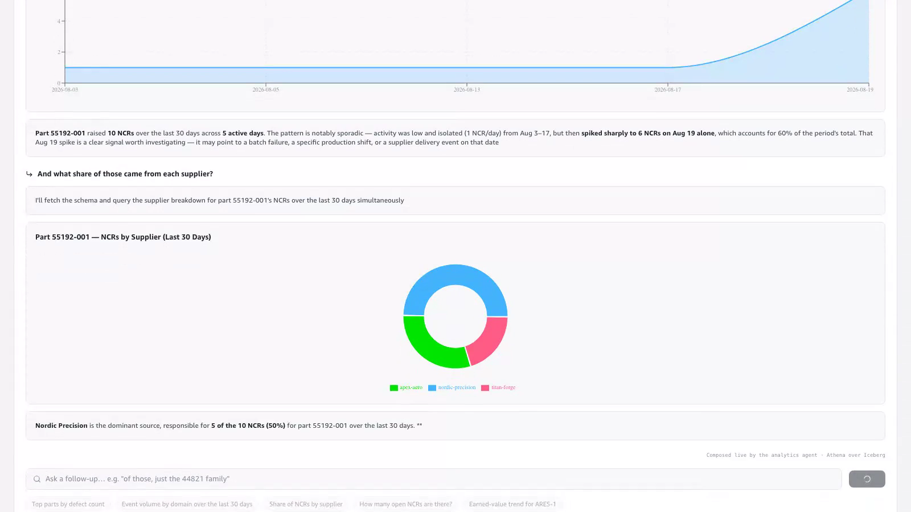

# AG-UI · Generative Analytics

**Story:** On the **Analytics page** (`#/datalake`), scroll past the fixed Athena
panels to the **"Ask the datalake"** console and hold a **conversation** with the
analytics agent. Each answer streams back over the [AG-UI
protocol](https://docs.ag-ui.com/) as the **widgets the agent chose** — and every
follow-up builds on the previous turn. Ask for the top parts, then "for the top
one, show its trend", then "what share of those came from each supplier" — the
agent resolves "the top one" and "those" from the thread, and picks a different
widget each time (bar → area → donut), all painted with the app's own components.

🎬 **Video:** [`video/agui-demo.mp4`](video/agui-demo.mp4) (~42 s, login-free)

**Where it lives:** the generative console is folded into the existing Analytics
page — beneath the Program Earned Value, Top-suppliers and Holds panels — badged
**AG-UI · GENERATIVE**, footed *"Composed live by the analytics agent · Athena
over Iceberg"*. There is no separate page.

**How it works:** the console opens one AG-UI `HttpAgent` per conversation
(stable thread id + AgentCore runtime session) against the deployed runtime
(`aerospace_agui_analytics`, Bedrock Sonnet + Athena tools). Each turn appends the
new question to the running thread and re-sends the transcript, so the agent has
context. `TEXT_MESSAGE_*` events render as prose; `render_chart` / `render_table`
tool calls render with the app's native widgets (`hbar`→`TopBars`,
`line`/`area`→Recharts trend, `pie`/`donut`→Recharts pie, `stat`→a KPI tile,
`render_table`→`ResultTable`). Chat layout: the thread reads top-to-bottom and
the composer (input + chips) sits at the **bottom**, beneath the latest answer.
As the agent streams, the page **autoscrolls** to keep the newest content in view
— unless you scroll up to read a prior turn, in which case it leaves you there.
Every turn stays on screen as the thread grows; a **New conversation** control
resets it.

---

## Turn 1 — "Top parts by defect count" → horizontal bars + ranked table

The agent runs Athena and renders a **horizontal bar chart** plus a **ranked
table** and a prose takeaway.

| Rank | Part number | Defect count |
|-----:|-------------|-------------:|
| 1 | 55192-001 | 29 |
| 2 | 44821-003 | 28 |
| 3 | 44821-007 | 22 |
| 4 | 44821-012 | 21 |
| 5 | 55192-004 | 20 |

## Turn 2 — "For the top one, show its NCRs per day over the last 30 days" → area trend

A follow-up. The agent resolves **"the top one"** to **55192-001** from Turn 1 (no
part number restated) and renders an **area trend** plus a stat tile. Turn 1 stays
on screen above it.

The daily NCRs for **55192-001** were sporadic, then **spiked to 6 on 2026-08-19**
(60% of the part's 10 NCRs in the window).

## Turn 3 — "And what share of those came from each supplier?" → donut

Another follow-up. The agent resolves **"those"** to 55192-001's NCRs and renders
a **donut** of supplier share. Turns 1 and 2 remain above it in the thread.

**Nordic Precision** accounts for **50% (5 of 10)**, Apex Aero 30%, Titan Forge 20%.

---

## Live evidence

The clip is a live end-to-end run: **browser → deployed AG-UI runtime → Athena
over Iceberg → streamed widgets**. Nothing is mocked. It is one **conversation**:
each follow-up resolves a referent ("the top one", "those") from the prior turn,
and prior turns stay visible as the thread grows. Timeline of the shipped MP4
(Athena "thinking" waits are speed-ramped; every widget reveal and each typed
follow-up play at 1×):

- **~5 s** — the folded console on the Analytics page; five sample chips.
- **~9 s** — Turn 1's bar chart autoscrolls into view as it renders (still
  streaming) — no manual scroll; **~13 s** it settles as chart **and** ranked
  table (55192-001 → 29).
- **~22 s** — Turn 2 (typed as a follow-up in the bottom composer): the view
  follows to the **area trend for part 55192-001** — the agent resolved "the top
  one" — with Turn 1 still on screen above it.
- **~32 s** — Turn 3 (follow-up): the view follows to the **donut of 55192-001's
  NCRs by supplier** — the agent resolved "those" — with Turns 1 and 2 above it.
- **~40 s** — "New conversation" clears the thread.

Across the conversation the agent renders **hbar + area + donut + stat + table +
prose** — four chart kinds, each in the app's native styling, and two follow-ups
that provably carry context.
