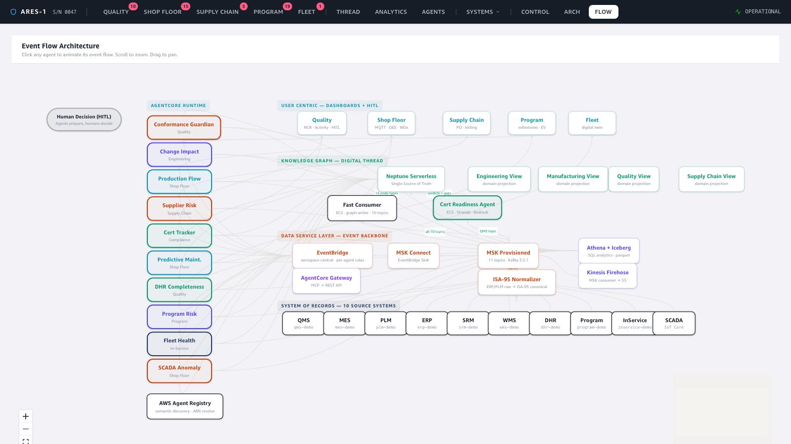
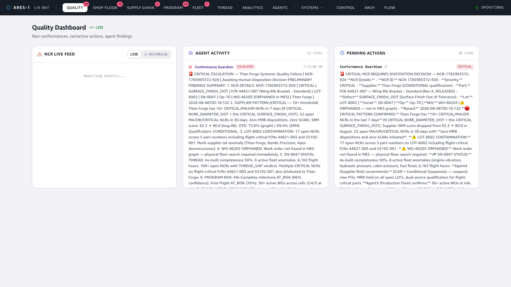
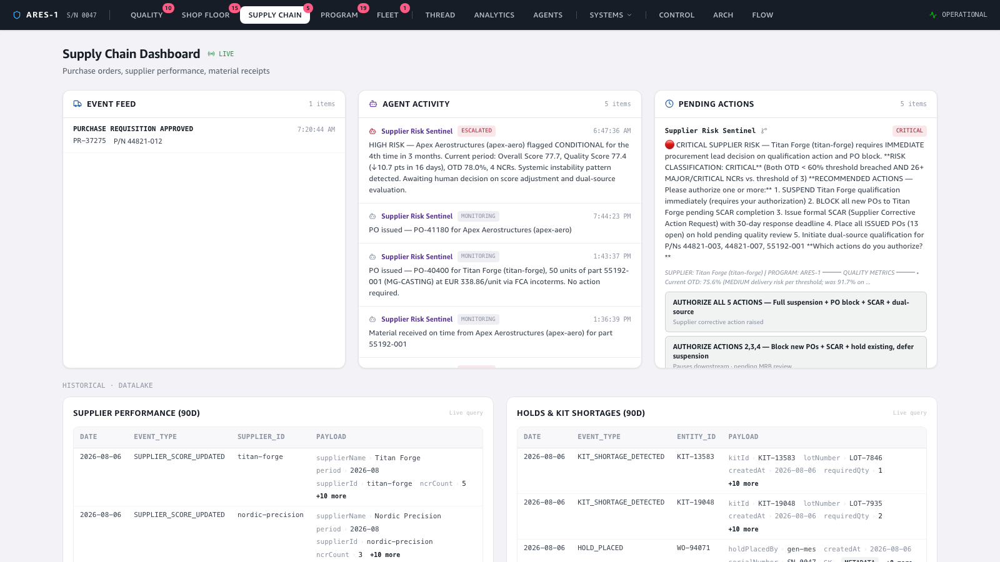
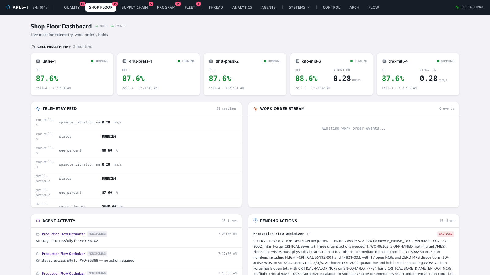
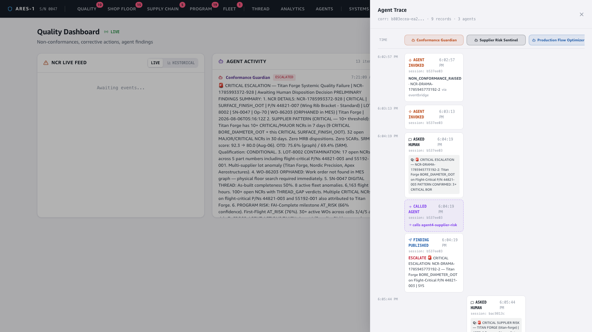

# Demo — The Cascade: one defect, every system, many agents

**Story:** a single quality event — a cluster of non-conformances on a flight-critical
part — is injected once. From that one event, the **event-driven backbone** fans it
out to every interested system, **multiple AI agents** wake up independently on their
own domains, they **hand off to each other** (agent-to-agent), and every step is
**captured as an auditable trace**. No orchestrator scripts the cascade — it emerges
from the events.

Trigger: the `ncr-cluster` drama scenario — **3 CRITICAL NCRs on P/N 44821-003
(wing box bore fitting) from supplier Titan Forge, LOT-7731**.

🎬 **Video:** [`video/cascade-demo.mp4`](video/cascade-demo.mp4) (continuous screen recording)

---

## 1. The backbone — events fan out, agents are wired in

The animated flow view shows the event backbone. Source systems publish on the left,
events flow through MSK → EventBridge, and each agent subscribes only to the event
types its domain cares about. The dashed arrows **between** agents are the
agent-to-agent (A2A) call edges — e.g. Conformance Guardian → Supplier Risk Sentinel.



## 2. Quality wakes up first — the Conformance Guardian

The NCR cluster lands on the Quality dashboard. The **Conformance Guardian** agent
ingests each NCR, recognises the *pattern* (60+ MAJOR/CRITICAL NCRs concentrated on
one supplier + one flight-critical part), and escalates — preparing a disposition for
a human rather than acting on its own.



## 3. The same event reaches Supply Chain — the Supplier Risk Sentinel

The Conformance Guardian doesn't just file a finding — it **calls the Supplier Risk
Sentinel** (A2A). On the Supply Chain dashboard, that agent has independently scored
the supplier risk and raised its own escalation, citing the supplier and the
qualification-status decision it needs from a human.



## 4. …and Shop Floor — the Production Flow Optimizer

The cluster also implicates open work orders running that part. The **Production Flow
Optimizer** reacts on the Shop Floor dashboard, assessing cascade risk to in-flight
production and recommending holds/alternate routing.



## 5. The payoff — one auditable cascade, rendered as swim lanes

Click any finding to open its **trace**. Because every agent action carries the same
`correlationId` (and A2A calls propagate it), the whole cascade reconstructs as
**swim lanes — one column per agent** — in time order:



Reading the lanes left-to-right, from the same `correlationId`:

```
Conformance Guardian            Supplier Risk Sentinel        Production Flow Optimizer
─────────────────────           ──────────────────────        ─────────────────────────
NON_CONFORMANCE_RAISED
  (NCR-…-357, eventbridge)
ASKED HUMAN
  (disposition on SN-0047)
CALLED AGENT  ───────────────▶  (invoked via A2A)
  → agent4-supplier-risk
FINDING PUBLISHED               ASKED HUMAN
                                  (CRITICAL SUPPLIER RISK —
                                   procurement lead decision)
                                FINDING PUBLISHED             ASKED HUMAN / FINDING PUBLISHED
```

This single view proves the architecture's core claim end-to-end: **one event →
many systems → many agents → explicit human-in-the-loop → full auditability**, with
the agent-to-agent handoff shown as a first-class `CALLED AGENT` step (purple), not
hidden plumbing.

---

### How it was captured
The `ncr-cluster` scenario was injected via the Demo Control panel (`inject-drama`),
which writes the NCRs to DynamoDB; from there the live deployed pipeline (eu-west-1)
did everything else — DynamoDB streams → MSK → EventBridge routing → agents on
AgentCore reasoning with Bedrock, calling `ask_human` / `publish_finding` /
`call_agent`, each step written to the `agent-trace` table. The frontend was run
locally (`npm run dev`) and driven with Playwright (continuous video + 2× stills).
The swim-lane trace shown is a real 3-agent cascade (`corr 2f0d0c11…`, 8 records).
