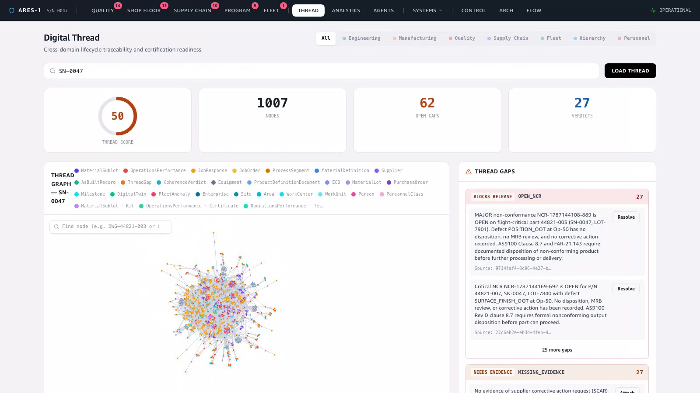
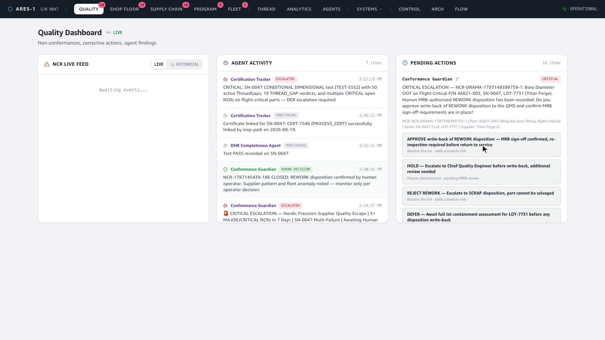
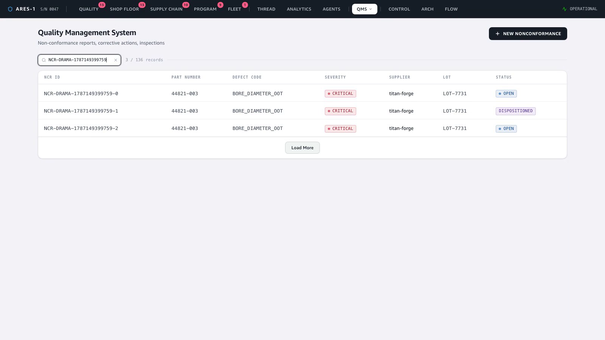

# Demo — Cross-Silo Agent: Query → Decide → Write Back

**Story:** a Business-Applications agent spans domains — it **queries** the digital
thread and data lake for context, **pauses for a human** to authorize the consequential
action (HITL), then **writes the decision back to a system of record** (the QMS), all
through the governed gateway. This is the cross-silo "agents prepare, humans decide"
pattern the whole platform exists to enable.

Serial in focus: **SN-0047**, NCR **NCR-DRAMA-…759** on P/N 44821-003 — a REWORK
disposition prepared by the agent, authorized by a human, and written back to the QMS.

🎬 **Video:** [`video/crosssilo-demo.mp4`](video/crosssilo-demo.mp4) (~37 s, login-free)

---

## 1. Query — the agent reads the thread + lake

The agent pulls cross-domain context from the SN-0047 knowledge graph (1007 nodes,
open gaps, verdicts) before proposing anything — engineering, manufacturing, quality,
supply chain and fleet, on one thread.

## 2. Decide — a human authorizes (HITL)

The consequential action pauses on the Quality dashboard: the agent has prepared a
REWORK disposition and asks a human to **approve the write-back** — a governed agent
identity acting on-behalf-of a person, with MRB sign-off.

## 3. Write back — to the system of record

On approval the disposition is written to the **QMS** via the governed gateway:
NCR-DRAMA-…759-1 flips to **DISPOSITIONED**. The regulated system of record is updated
directly through the gateway — not step-by-step through intervening layers.

## Why it matters

This is the full "agents prepare, humans decide" contract in one clip: a cross-domain
**read**, a governed **human decision**, and an audited **write** to a regulated system
of record — the pattern every cross-silo agent follows, mapping onto whatever graph,
data-lake, and API-management platforms an enterprise already runs.
