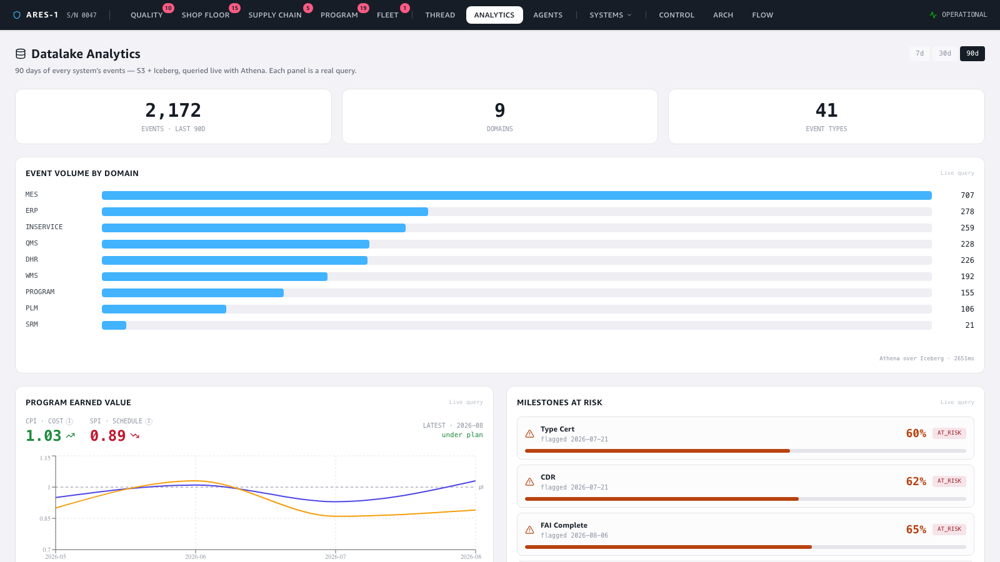
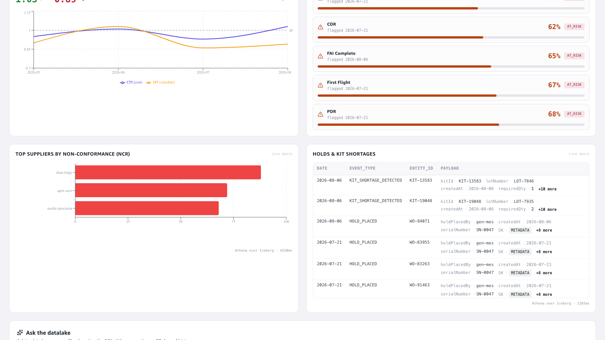
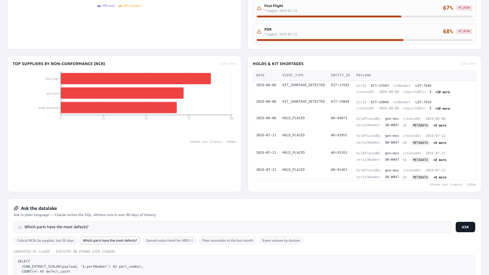

# Demo — Datalake Analytics: the whole event lake, queried live (incl. text-to-SQL)

**Story:** every event from all ten systems is fanned to **S3 + Iceberg**, giving 90 days
of queryable history. This demo opens the dedicated **Analytics** page — a business-first
window onto that lake — and ends with **"Ask the datalake"**: a plain-language question that
**Claude turns into Athena SQL**, runs live, and answers with real rows. Not one chart: the
whole lake, as decision-grade analytics and as a natural-language query engine.

> This is the operator's counterpart to the Digital Thread page (which surfaces Neptune).
> Where [demo 7](../datalake-demo/README.md) showed a single historical NCR trend, this
> surfaces the lake as a first-class analytics pillar.

🎬 **Video:** [`video/datalake-analytics-demo.mp4`](video/datalake-analytics-demo.mp4) (~105s continuous screen recording)

---

## 1. One lake, every system — the cross-domain heatmap

The Analytics page (`#/datalake`) opens on a KPI row and a **domain × event-type heatmap**:
every cell is a real count from Iceberg, so you can see the whole event backbone's 90-day
shape at a glance — MES dominating with work-order events, QMS non-conformances, ERP
invoices, the fleet's in-service anomalies. Each panel carries a live **"Athena over Iceberg
· {ms}"** badge — these are queries, not cached numbers.

## 2. Business-first, not IT-first — Program earned value & milestones

The program panels lead with the metric a program office actually reads, not the storage
envelope. **Earned Value** shows **CPI (cost)** and **SPI (schedule)** against the 1.0 plan
baseline — here **0.88 / 0.87, under plan** — as a trend, not a JSON dump. **Milestones at
risk** shows *Type Cert* at **64% confidence, AT_RISK** as a confidence bar. Exploratory
panels (holds, suppliers) render each JSON payload as readable key›value field-strips with
type-aware styling, expandable for the full record.

## 3. Ask the datalake — natural language → SQL → live answer

The payoff. Type a plain-language question — *"Which parts have the most defects?"* — and
**Claude (Bedrock) generates the Athena SQL**, which runs live over Iceberg. The generated
SQL is shown verbatim (labelled *generated by Claude, executed on Athena over Iceberg*), so
there's nothing hidden: the SQL you see is the SQL that ran. Below it, the real answer —
`55192-001: 22 defects, 44821-012: 21, …`.

The generation is grounded in the table schema + a payload-field catalog, and every
generated query passes the **same guardrails** as hand-written SQL (SELECT/CTE-only,
single-statement, must reference `domain_events`) **plus a hallucinated-field guard** — so a
model that invents a column is rejected with the SQL shown, never executed blindly.

---

### Live evidence (not just the UI)
Captured against the live deployed pipeline (eu-west-1) at recording time:

| Signal | Value |
|---|---|
| Events in the lake (90d) | **976** across **9 domains**, **26** domain×type combinations |
| Named Athena queries wired to panels | **13** (heatmap, EV, milestones, suppliers, holds, …) |
| Text-to-SQL accuracy (spike) | **100%** on the demo question set, with the schema+field-catalog prompt |
| Text-to-SQL latency (generate + query) | **~2–4 s** end to end |
| Query engine | **Amazon Athena over S3 + Iceberg**, Bedrock (Claude) for SQL generation |

Text-to-SQL questions verified live end-to-end (each generates valid SQL and returns rows):
"critical NCRs by supplier", "which parts have the most defects", "event volume by domain",
"earned-value trend for ARES-1".

### How it was captured
Frontend run locally (`npm run dev`), driven with Playwright as one continuous video
recording, transcoded to MP4. Panels wait on the Athena queries resolving before the hold
(no spinners on camera); the text-to-SQL beat types a real question and waits for the
generated SQL + results table to render. All data is live — the heatmap counts, EV/milestone
metrics, and every generated-SQL answer are from the deployed pipeline, not mocked.
The `text2sql` op lives in the `aerospace-athena-query` Lambda (Bedrock generation → shared
SQL guardrails → Athena).
