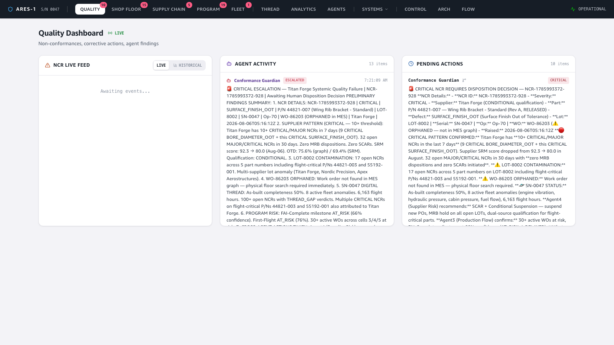

# Demo — The Datalake: querying 90 days of history from the frontend

**Story:** the dashboards run live off the event stream (AppSync subscriptions) —
great for *what's happening now*, useless for *what happened last quarter*. Every
event is also fanned to **S3 + Iceberg** via Firehose, so the same data is queryable
as history. This demo flips the Quality dashboard from its real-time NCR feed to a
**Historical** view and widens the lens from a week to the full 90-day baseline —
each click re-querying **Athena over Iceberg** live, through API Gateway (Cognito
auth + 300 s cache). No pre-aggregation, no separate reporting DB: the operational
event lake *is* the analytics store.

🎬 **Video:** [`video/datalake-demo.mp4`](video/datalake-demo.mp4) (continuous screen recording — watch the trend widen 7d → 30d → 90d)

---

## 1. The operational view — real-time NCR feed

The Quality dashboard opens on the **live** event stream: non-conformances as they
land, agent activity, and pending human decisions. This is the AppSync-subscription
surface — sub-second, but only *now*.

The **`LIVE` / `HISTORICAL`** toggle on the NCR panel is the pivot: same panel, two
data paths. `LIVE` is the WebSocket subscription; `HISTORICAL` switches to the
datalake.

## 2. The historical view — Athena over Iceberg

Switching to **Historical** issues a `POST /query/athena` (`query: ncrTrend`,
`groupBy: severity`) through API Gateway. The Lambda runs an Athena query over the
Iceberg table `aerospace_events.domain_events`, grouping NCRs by day and severity.
The result renders as a stacked bar chart — **MINOR / MAJOR / CRITICAL** — with the
live query latency stamped underneath: *"Athena over Iceberg · {ms}"*.

The window picker (**7d / 30d / 90d**) is the demo's spine: each click re-runs the
Athena query for a wider range. At 90 days the chart fills with the full seeded
baseline — every severity, every day across the quarter, queried on demand from the
same lake the agents read.

## 3. Event time, not ingestion time

Producers stamp `occurredAt` from the record itself (`updatedAt`, then `createdAt`), so the
90-day seeded history lands in Iceberg on the dates it represents and `ncrTrend(days: 90)` returns
a real quarter of history (Athena `occurred_at` spans the full seed window).

---

### How it was captured
The pipeline is live (eu-west-1): seeded baseline → DDB → producer Lambdas → MSK →
Firehose → S3/Iceberg, with Athena (workgroup `aerospace-dashboards`) fronted by API
Gateway. The frontend runs locally and is driven with Playwright; the script logs in,
opens the Quality dashboard, switches to **Historical**, then clicks **30d** and
**90d**, holding on the full-quarter trend. Each window click is a real Athena query —
the latency in the footer is measured, not mocked.

**The fix that made it real:** the three producer Lambdas were stamping ingestion time
instead of event time, so the datalake only ever showed the last few days. Stamping
`updatedAt`/`createdAt` restored the full 90-day history to Iceberg — and to every
Athena consumer (this chart, the agents' `query_datalake` tool, the named queries).
