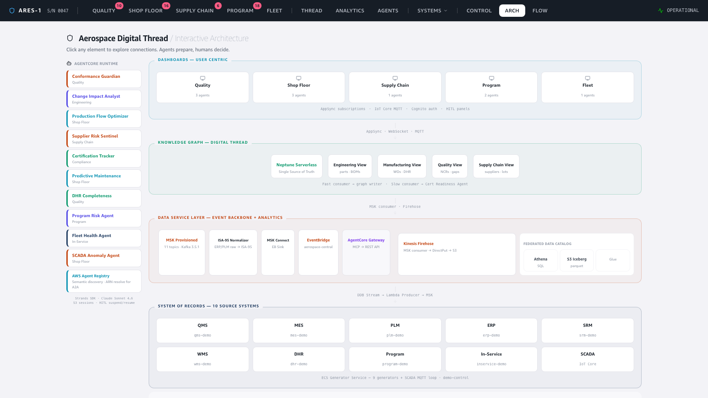
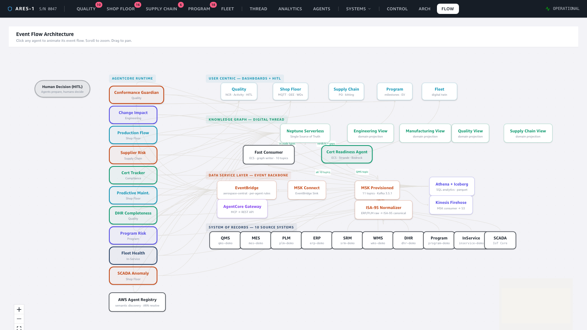
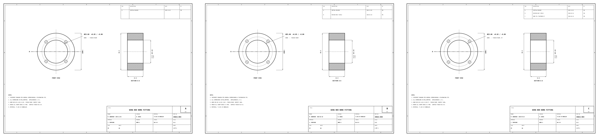
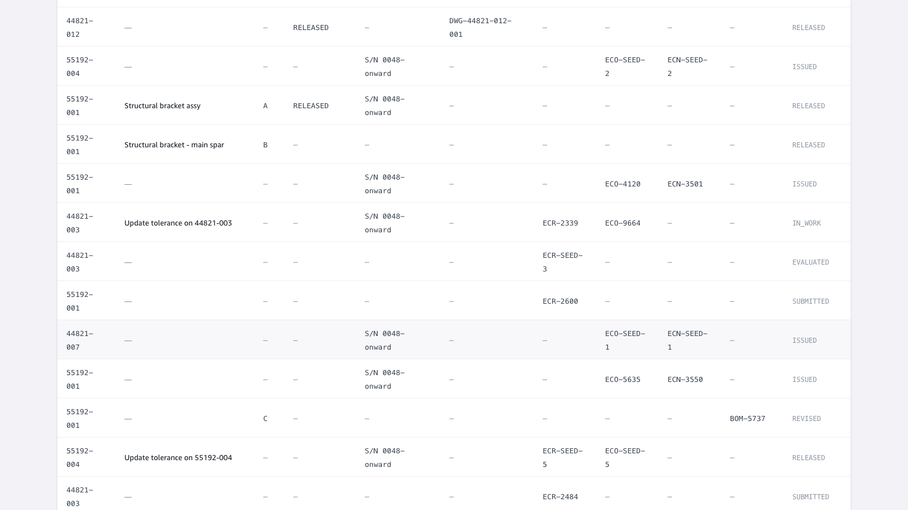
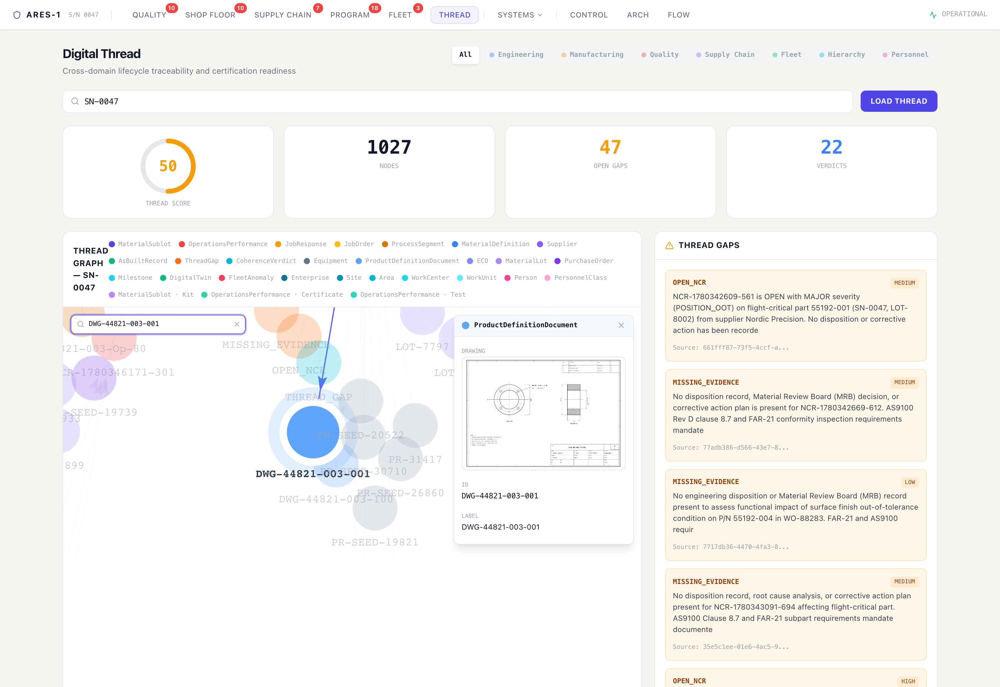
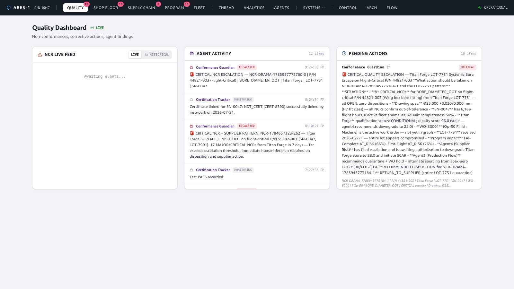

# Demo — 2D Engineering Drawings as Unstructured Data

**Story:** a PLM platform releases a 2D engineering drawing → it's stored as an
unstructured artifact in S3 → referenced from the `DRAWING_RELEASED` event →
linked onto the ISA-95 knowledge graph → a dashboard can render it → and an **AI
agent reads the drawing with vision** to extract the as-designed bore tolerance and
correlate it to a `BORE_DIAMETER_OOT` defect.

Part in focus: **P/N 44821-003 "Wing box bore fitting"** — shown across its **three
revisions (A → B → C)**. The bore tolerance is *tightened* at rev C (Ø25.00 +0.05 →
**+0.02 / −0.00 H7**), which is exactly what makes the in-service measurement
out-of-tolerance. The revision history *is* the explanation for the defect.

🎬 **Video:** [`video/drawing-demo.mp4`](video/drawing-demo.mp4) (continuous screen recording)

---

## 1. Where it sits — architecture

The interactive architecture page shows the full enterprise stack. Drawings are
produced by the PLM source system (bottom), stored in the datalake, linked on the
Neptune knowledge graph (middle), and read by the agents (left).



The animated flow view shows the event backbone the drawing reference travels on:



## 2. The artifact — a generated 2D drawing, versioned

Each drawing is rendered (matplotlib) and stored at
`s3://…/drawings/{partNumber}/{drawingNumber}-{rev}.png` — real unstructured data with
a title block, two orthographic views, a dimensioned + toleranced bore, and a
revision block. Crucially, **each revision is its own artifact**. Compare rev A and
rev C of 44821-003:



The deltas are real and visible on the sheets: rev A's bore reads **Ø25.00 +0.05 /
−0.00** (no fit class, single revision-block row); rev C reads **Ø25.00 +0.02 / −0.00
H7** with all three revision rows (A INITIAL RELEASE · B REVISED BOLT CIRCLE · C BORE
TOL TIGHTENED H7). A bore measured at **Ø25.04** passes under rev A/B (+0.05) but is
**out-of-tolerance under rev C (+0.02)** — the tightening is the defect.

## 3. Shown in the dashboard — PLM "Released Drawings" gallery

The PLM page lists parts/drawings/ECOs with their revisions and maturity, and a
**Released Drawings** gallery renders the actual artifacts in-app via short-TTL
presigned URLs (the bucket stays private; the browser never holds S3 credentials).
The three revisions of 44821-003 sit side by side — **rev C is RELEASED** (green),
**A and B are SUPERSEDED** (grey) — so the evolution reads left to right:



## 4. Linked on the digital thread (ISA-95 graph) — and rendered in the node

The drawing becomes `drawingUri` / `drawingS3Key` properties on the ISA-95
**`ProductDefinitionDocument`** node, reachable from the part's `MaterialDefinition`
via the `hasDocument` edge. Use the graph's **node search** to jump to
`DWG-44821-003-001` — the node detail panel renders the drawing inline:



## 5. The payoff — an agent reads the drawing, on the dashboard

When a `BORE_DIAMETER_OOT` NCR lands on flight-critical P/N 44821-003, the Conformance
Guardian agent calls its `read_drawing` tool: it resolves the drawing from the graph
(`MaterialDefinition --hasDocument--> ProductDefinitionDocument`), fetches the PNG from
S3, and uses **Bedrock Claude vision** to read the toleranced bore dimension off the
sheet. It then compares the as-designed band to the as-measured value on the NCR and
escalates — the finding appears **live on the Quality dashboard**:



> **Conformance Guardian · ESCALATED** — CRITICAL ESCALATION … Titan Forge
> `BORE_DIAMETER_OOT` on flight-critical P/N 44821-003 (SN-0047, LOT-7731).
> **As-measured 25.04 mm vs. drawing tolerance 25.000 +0.020/+0.000 mm (H7) — EXCEEDS
> upper limit by 0.020 mm.** … Immediate MRB disposition, lot quarantine, and supplier
> SCAR required.

The agent reads the **currently-released revision (C)**, so it cites the *tightened*
+0.02 band (allowable 25.000–25.020 mm) — not the superseded +0.05 — and correctly
calls the 25.04 mm bore out-of-tolerance. Under rev A/B (+0.05) the same measurement
would have passed; it fails **because the agent read the right revision**. That is the
extraction behind the card, validated end-to-end:

```
graph → drawingS3Key: drawings/44821-003/DWG-44821-003-001-C.png   (RELEASED rev-C, 210 KB)
S3 PNG → Bedrock vision → { partNumber: 44821-003, revision: C,
                            boreNominalDiameterMm: 25.00,
                            boreToleranceUpperMm: 0.02, boreToleranceLowerMm: 0.00,
                            fitClass: H7 }
```

The loop from a versioned, unstructured artifact to a structured, human-authorizable
conformance decision on the dashboard is closed — and it gets the answer right because
it read the right revision.

---

### How it was captured
Frontend run locally (`npm run dev`), driven with Playwright (continuous video +
stills). The three revisions are deterministic renders committed under
`config/drawings/44821-003/` and deployed to S3 by the storage stack; the seed writes
one `DRAWING#` record per revision (A/B SUPERSEDED, C RELEASED). The graph linkage and
the vision extraction are from the live deployed pipeline (eu-west-1). The section-5
finding is a real, live Conformance Guardian escalation: a fresh `BORE_DIAMETER_OOT`
NCR on 44821-003 drove the pipeline (DDB stream → producer → MSK → EventBridge →
agent), the agent called `read_drawing`, and the card was captured as it arrived over
the AppSync subscription.

