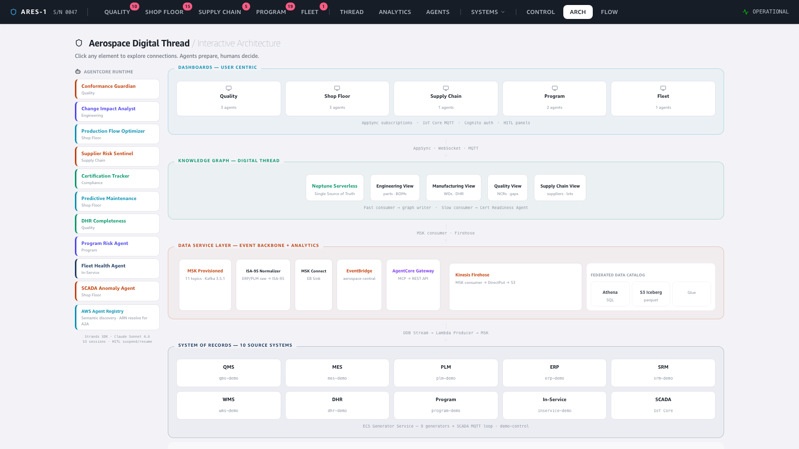
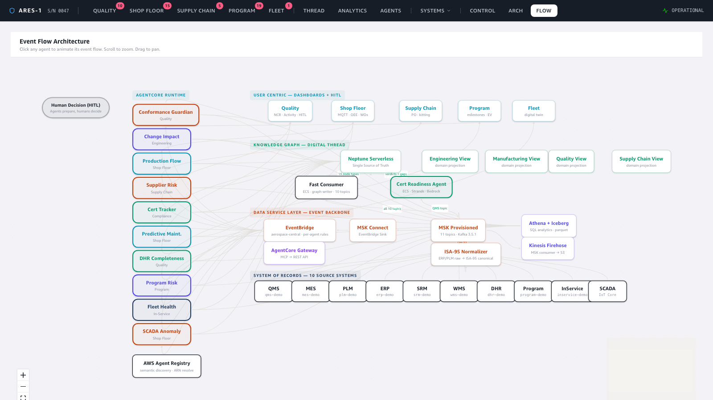
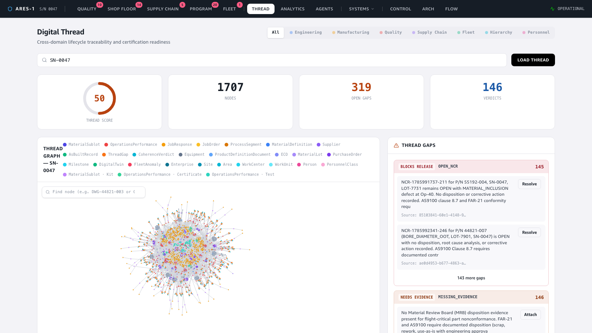
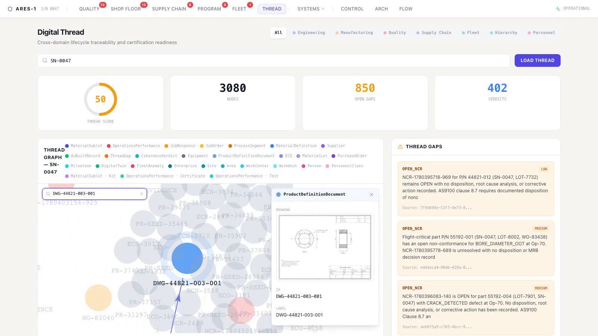
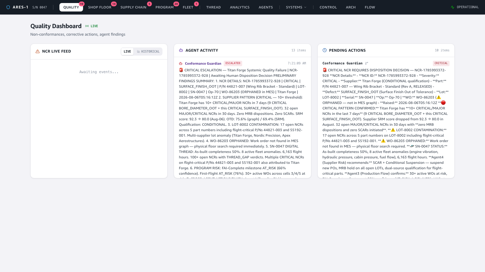
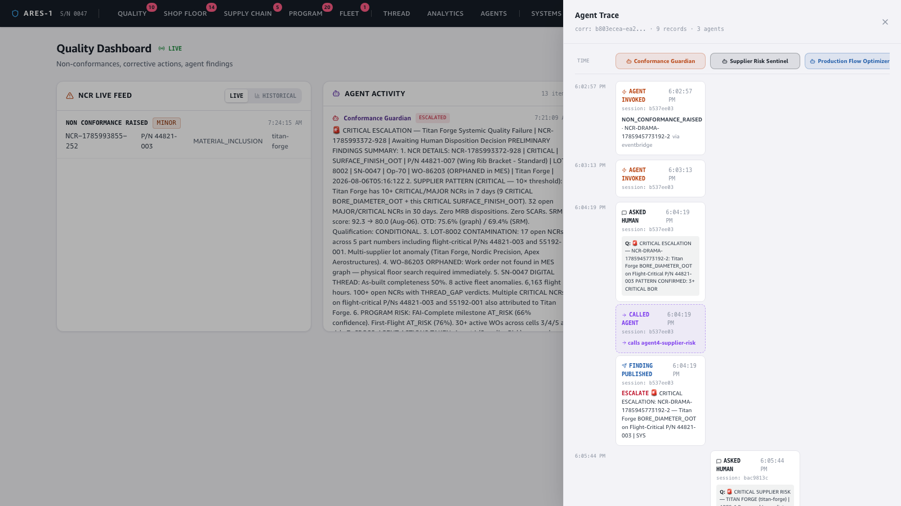
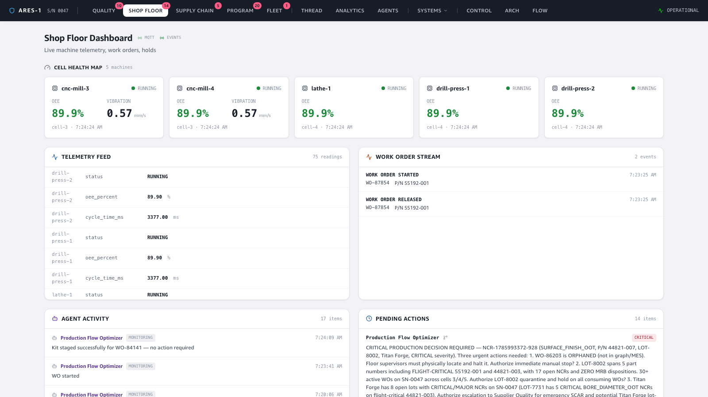

# Hero Demo — Digital Continuity, end to end, with agents driving the process

**The whole picture in one take.** A single commercial-aircraft wing-box serial number
(**ARES-1 · S/N 0047**) is tracked from engineering design, through the shop floor and
supply chain, all the way to the in-service fleet — every system connected on one
**digital thread**, with **10 AI agents** orchestrating the work and **humans deciding**
every regulated outcome. This demo doesn't prove a single pillar; it shows how they
compose into continuous, auditable digital continuity — including a human answering an
agent's question live and the full multi-agent trace behind it.

> The focused demos under [`docs/specs/`](../DEMOS.md) each zoom into one pillar
> of this picture (the cascade, HITL, SCADA, the graph, the datalake, drawings,
> normalization). This is the one that steps back and shows the whole.

🎬 **Video:** [`video/hero-demo.mp4`](video/hero-demo.mp4) — one continuous ~60 s screen recording, no cuts.

---

## 1. The whole stack, one frame

The interactive architecture page is the map: **10 AgentCore agents** down the left,
**5 user-facing dashboards** up top, the **Neptune knowledge graph** (the digital thread)
as the single source of truth, the **event backbone** (MSK · ISA-95 normalizer · MSK
Connect · EventBridge · Firehose) in the middle, and the **10 source systems** of record
along the bottom. The banner says it plainly: *Agents prepare, humans decide. Secured and
robust infrastructure — sovereign by design · AWS CDK · 15 stacks · eu-west-1.*

## 2. Data in motion — the event backbone

Every record change in any of the 10 systems becomes an event that flows across the same
backbone — DynamoDB stream -> producer -> **MSK (Kafka)** -> ISA-95 normalizer -> EventBridge
-> the agents and dashboards, and in parallel -> Firehose -> **S3 + Iceberg** for history.
The animated flow view shows that fan-out: one source, many consumers, all decoupled.

## 3. The digital thread — one graph, design -> build -> fleet

This is the centerpiece. The **Neptune** knowledge graph reconstructs the full lifecycle of
S/N 0047 as one connected web — **~3,000 nodes / ~850 edges** spanning Engineering, Manufacturing,
Quality, Supply Chain, and Fleet. A slow-consumer **Certification-Readiness agent** scores the
thread continuously (readiness gauge, left) and flags **THREAD GAPS** (right) — missing
inspections, undisposed NCRs, broken traceability — that a human must close before the
serial number can be certified.

## 4. Unstructured data on the thread — search a node, read the drawing

The graph isn't just structured records. Typing a node id into the **node search** box
(`DWG-44821-003-001`) centers the released drawing node and its detail panel renders the
actual **2D engineering drawing** inline — fetched from S3 via a presigned URL. The
unstructured artifact (title block, orthographic views, toleranced bore) lives on the same
thread as everything else, which is exactly what lets an agent read it with vision (see the
[drawings demo](../drawing-demo/README.md)).

## 5. Agents drive the process — humans decide

On the Quality dashboard, NCRs stream in live; the **Conformance Guardian** agent reasons
over each one (reading the as-designed drawing, the supplier history, the graph) and
**escalates** what matters — but it never closes a record itself. Consequential actions land
in **Pending Actions** as `ask_human` questions with options; in the take, a human clicks a
disposition (RETURN_TO_SUPPLIER) to **authorize** it. Agents prepare; humans decide.

## 6. The agent trace — orchestration you can audit

Behind every escalation is a recorded trace. Opening it shows the **swim-lane** of a real
multi-agent cascade — **6 agents, 17 records** — Certification Tracker, DHR Completeness,
Conformance Guardian, Supplier-Risk Sentinel, Production-Flow Optimizer, and Program-Risk
Agent, with timestamped `AGENT INVOKED` → `ASKED HUMAN` → `FINDING PUBLISHED` → `CALLED AGENT`
(A2A) steps. This is how agents collaborate, escalate, and pause for humans — fully auditable.

## 7. The real-time edge — live shop floor

Most of the system runs on the Kafka event backbone; the shop floor is different. Machine
telemetry is **live 1 Hz MQTT**, streamed straight from IoT Core to the browser — the **Cell
Health Map** updates in real time (OEE, spindle vibration per machine). When a reading breaches
threshold, an IoT rule lifts it onto the backbone where the **Predictive-Maintenance** agent
picks it up. Raw sensor signal to actionable recommendation, on the same thread. The take then
continues through Supply Chain, Program, and In-Service before returning to the architecture
map — same serial number, same thread, every domain.

---

### Live evidence (not just the UI)
Captured against the live deployed pipeline (eu-west-1) at recording time:

| Signal | Value |
|---|---|
| Knowledge-graph nodes / edges | **~3,080 / ~850** (Neptune, live) |
| Certification gaps + verdicts | **~402** (slow-consumer agent) |
| Agent findings published | **~2,730** |
| Human-in-the-loop questions raised | **~1,830** |
| AI agents on AgentCore Runtime | **10** (A2A protocol, JWT auth) |
| Multi-agent trace shown | **6 agents · 17 records** (one correlationId) |
| Source systems on the thread | **10** (QMS, MES, PLM, ERP, SRM, WMS, DHR, Program, In-Service, SCADA) |
| CDK stacks deployed | **13** |

### How it was captured
Frontend run locally (`npm run dev`), driven with Playwright as one continuous video
recording (no cuts), transcoded to MP4. The narrative threads through architecture -> flow ->
digital thread -> **node-search drawing** -> quality (with a live HITL **answer**) ->
**agent trace** swim-lane -> shop floor -> supply chain -> program -> in-service ->
architecture. The force-graph is allowed to settle (`wait_for_selector("canvas")`), the drawing
is loaded by searching the node and waiting for `img[alt="Engineering drawing"]`, the HITL answer
clicks a real disposition button, the trace opens via the deep-link param
(`?trace=<correlationId>`), and MQTT telemetry is pre-warmed so the cell-health map streams on
camera. All data is live — graph counts, findings, HITL, the trace, and shop-floor telemetry are
from the deployed pipeline, not mocked.
