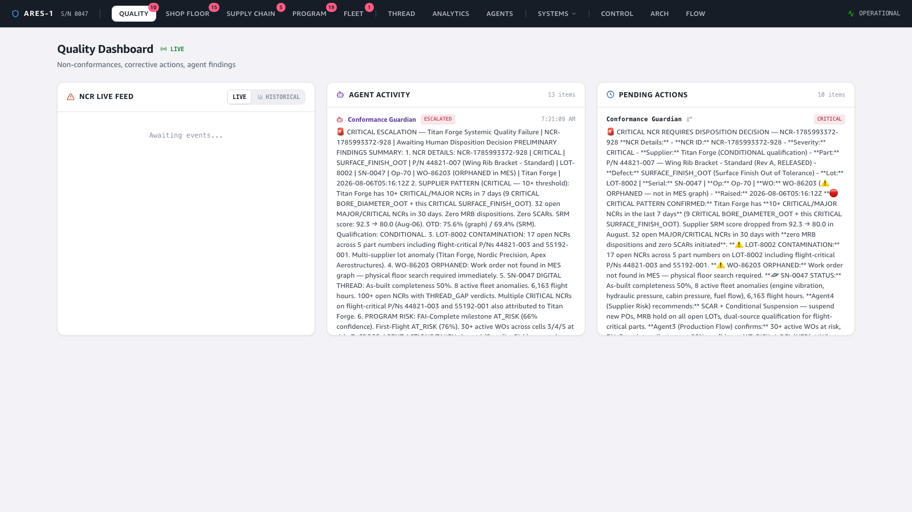
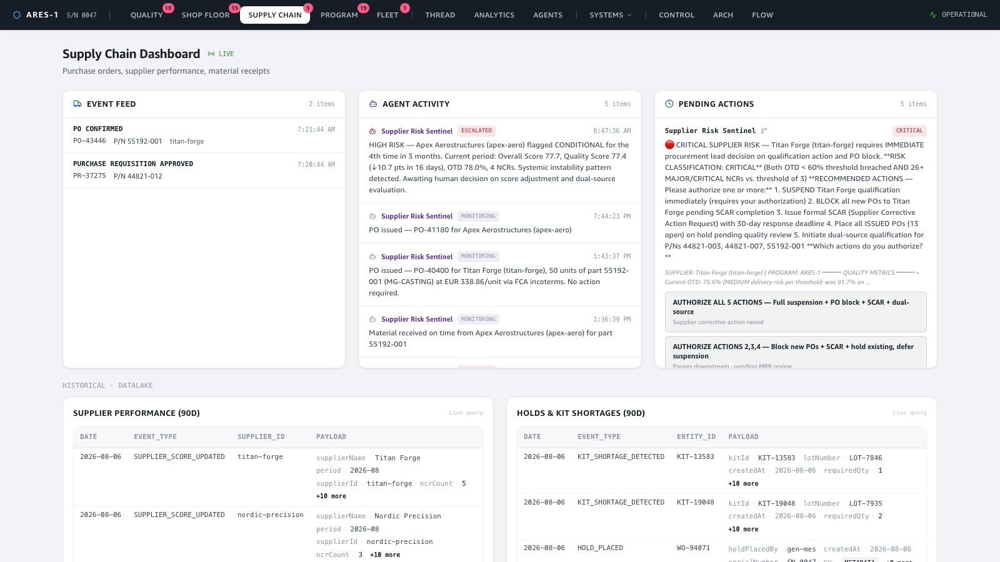
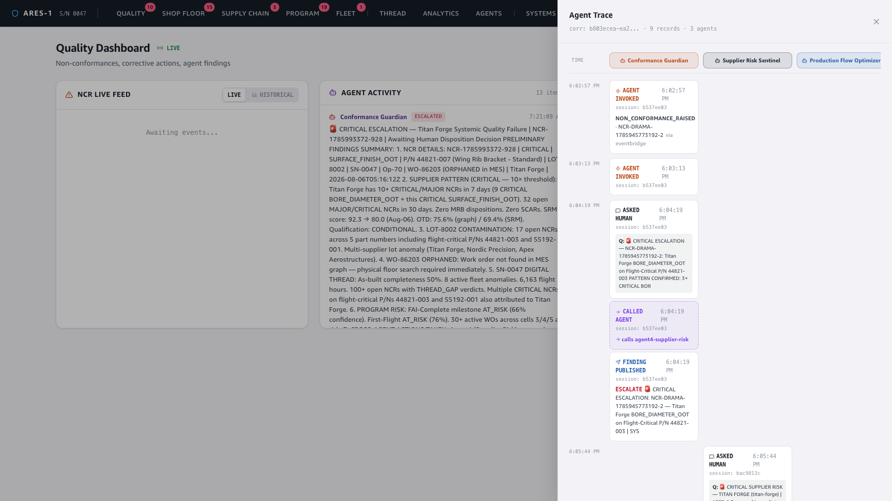

# Demo — Humans Decide: human-in-the-loop governance

**Story:** in a regulated industry, an AI agent must never close a quality record,
disposition a non-conformance, or release a part on its own. The architecture makes
this an **explicit agent behaviour**: when an agent reaches a consequential decision
it calls `ask_human`, **pauses**, and surfaces a prepared recommendation with options
on the dashboard. A human decides; only then does the agent resume and act. *Agents
prepare, humans decide* — and the whole exchange is auditable.

🎬 **Video:** [`video/hitl-demo.mp4`](video/hitl-demo.mp4) (continuous screen recording)

---

## 1. The dashboard — three columns, one governance story

The Quality dashboard puts the loop on one screen: the **NCR live feed** (what's
happening), **Agent Activity** (what the agents concluded), and **Pending Actions**
(what the agents need a human to decide). The agent has done the analysis but stopped
at the decision boundary.



## 2. The agent prepares — a disposition, not an action

The Conformance Guardian doesn't disposition the NCR. It assembles the case — the
defect, the supplier pattern, the in-service exposure — and presents **the options a
human would choose between**, in the regulator's own vocabulary:



> *"Titan Forge has 3 CRITICAL BORE_DIAMETER_OOT NCRs on flight-critical P/N
> 44821-003 … SN-0047 is in-service with 1,309 flight hours + active fleet anomalies.
> **What disposition and supplier action do you authorize?**"*
> — options: **REWORK · RETURN_TO_SUPPLIER · SCRAP · USE_AS_IS** (USE_AS_IS noted as
> requiring DER sign-off). The agent frames the decision; it does not make it.

## 3. The human decides — and the agent resumes

A human clicks a disposition. That answer flips the question to `ANSWERED`, which
(via a DynamoDB stream) resumes the *same* agent session on AgentCore. The agent
continues from where it paused, now acting on the authorized decision.

## 4. The payoff — the full loop, auditable

The trace for the decision shows the complete governance loop on one timeline — and
the **"Human Answered"** step (green) is a first-class, recorded event sitting between
the agent's question and its resumed action:



```
Agent Invoked        WO-98811 HOLD placed
Asked Human          "URGENT: WO-98811 HOLD requires a disposition decision"
Finding Published    CRITICAL HOLD
Human Answered   ◀──  "Maintain hold — escalate to MRB for full disposition review of SN-0047"
Finding Published    HOLD MAINTAINED — escalated to MRB
Session Stopped
```

Nothing consequential happened without the human step. The agent's recommendation,
the human's authorization, and the agent's resulting action are all on the record,
linked by one `correlationId` — exactly what an auditor or a certification authority
needs to see.

---

### How it was captured
A `single-ncr` scenario was injected (Demo Control → `inject-drama`); the Conformance
Guardian and Production Flow Optimizer agents (live, on AgentCore + Bedrock, eu-west-1)
reasoned and called `ask_human`, writing PENDING questions to the `hitl-questions`
table. A disposition was answered from the dashboard, the agent resumed via the DDB
stream, and each step was written to `agent-trace`. The trace shown is a real loop
(`corr 4b46289c…`, 6 records) opened via the dashboard's shareable trace deep-link
(`?trace=<correlationId>`). Frontend run locally; driven with Playwright.
