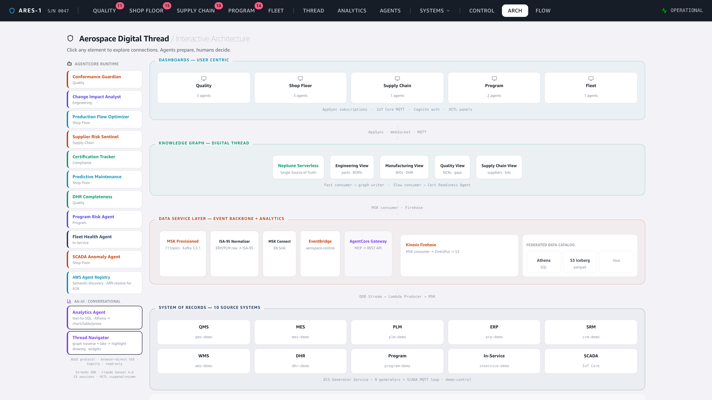
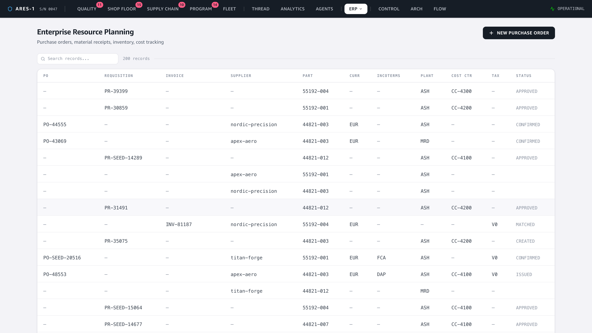
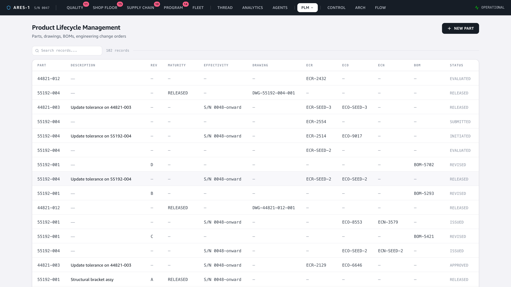
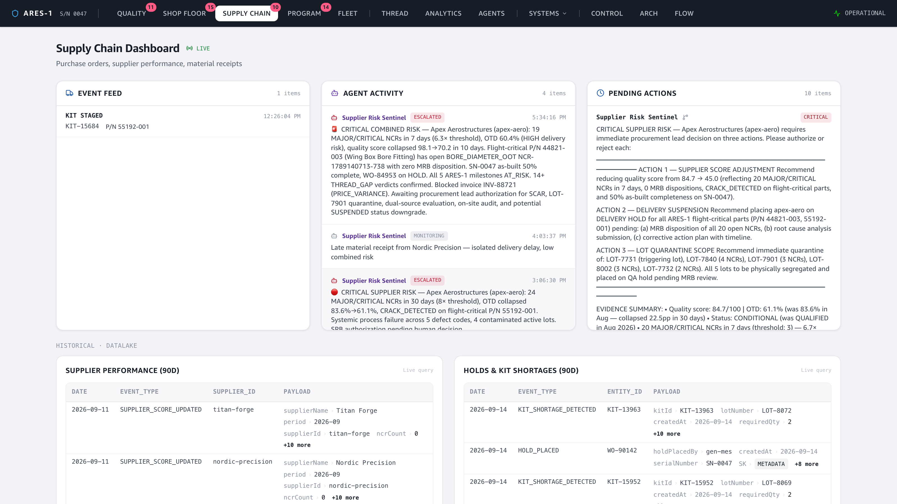
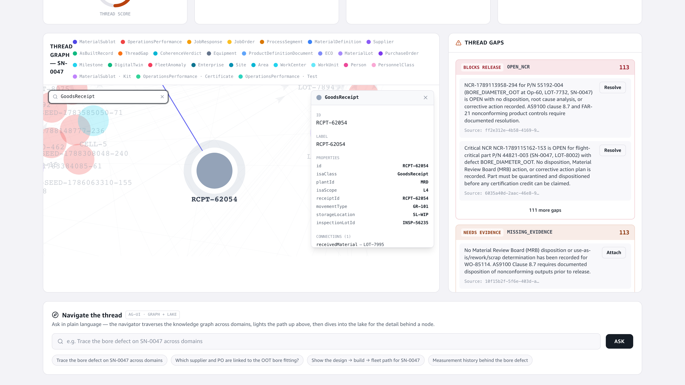
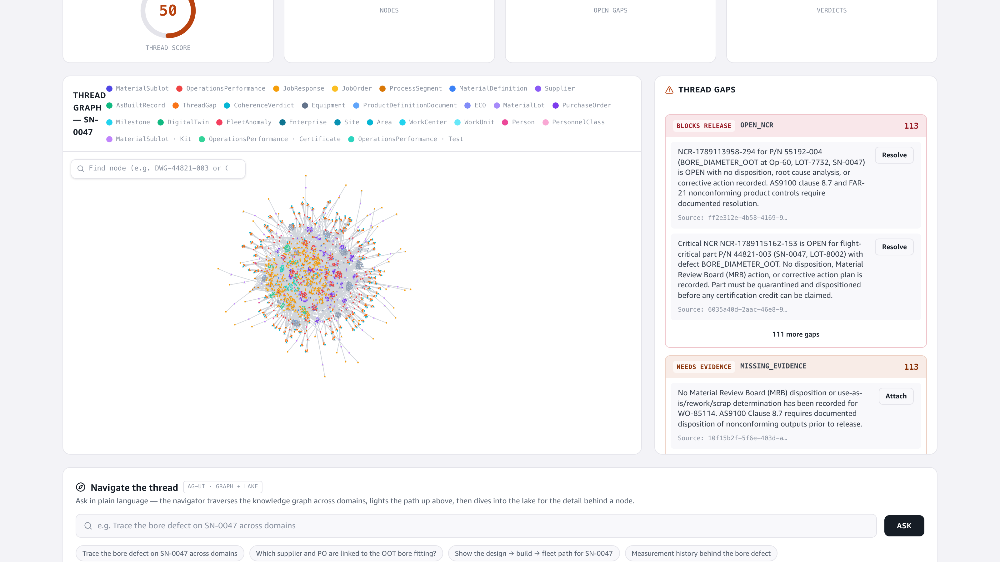

# Demo — Legacy ERP/PLM + ISA-95 Translation Lambda

**Story:** the "legacy" ERP and PLM applications publish their **native vendor
vocabulary** (purchase orders, goods receipts, engineering change orders…) to *raw*
MSK topics. A **normalizer Lambda at the MSK layer** maps that vocabulary to the
**ISA-95:2018 canonical model** and republishes to the canonical topics. Because the
knowledge graph, the datalake, **and** the agents all consume the canonical topics,
all three are ISA-95-compliant from one place. This illustrates the real-world
pattern: *a legacy system doesn't speak your canonical model, so you normalize at
the integration boundary.*

```
gen_erp / gen_plm → DDB → producer → aerospace.{erp,plm}.raw   (NATIVE vendor vocab)
                                        └→ ISA-95 Normalizer (Lambda, MSK→MSK)
                                             → aerospace.{erp,plm}.events  (ISA-95 canonical)
                                                 ├→ fast-consumer → Neptune  (ISA-95 graph)
                                                 ├→ msk-consumer  → Firehose → Iceberg (ISA-95 datalake)
                                                 └→ MSK Connect   → EventBridge → agents
```

🎬 **Video:** [`video/normalizer-demo.mp4`](video/normalizer-demo.mp4)

---

## 1. The translation step in the architecture

The Data Service Layer now shows the **ISA-95 Normalizer** ("ERP/PLM raw → ISA-95
canonical") sitting between MSK and the consumers. The MSK topic count is 11 (the
two extra are the `.raw` topics).



## 2. Legacy ERP — native procurement vocabulary

The ERP source system emits an authentic purchase-to-pay chain:
**PurchaseRequisition → PurchaseOrder (issued → confirmed) → GoodsReceipt →
SupplierInvoice (3-way match: received / matched / blocked)** — with realistic
fields (cost center, purchasing group, currency, incoterms, plant, tax code).



## 3. Legacy PLM — engineering-change workflow

The PLM source system emits the change chain **ChangeRequest (ECR) →
EngineeringChangeOrder (initiated → in-work → approved → released) → ChangeNotice
(ECN)**, plus part/drawing maturity states and BOM revisions.



## 4. Agents reason over the *normalized* events

The Supplier Risk Sentinel reacts to the canonical procurement events — reading the
enriched fields (currency, incoterms, plant) — and escalates a CRITICAL supplier
risk to a human for authorization. The agent never sees the raw vendor vocab; it
sees ISA-95.



## 5. The ISA-95 knowledge graph (normalized output)

The digital thread is built entirely from the canonical events — the normalized,
ISA-95-compliant output. Use the graph's **node search** to jump to a procurement
node (e.g. `GoodsReceipt`): the detail panel shows the normalizer's stamps —
`isaClass=GoodsReceipt`, `isaScope=L4`, plus `movementType`, `plantId`,
`storageLocation`:





---

## Proof the translation happened (live graph)

Every normalized node carries the `isaClass` / `isaScope` the normalizer stamped.
Queried live from Neptune after seeding:

```
GoodsReceipt           → isaClass=GoodsReceipt,           isaScope=L4
PurchaseOrder          → isaClass=PurchaseOrder,          isaScope=L4
SupplierInvoice        → isaClass=SupplierInvoice,        isaScope=L4
EngineeringChangeOrder → isaClass=EngineeringChangeOrder, isaScope=extension
ChangeNotice           → isaClass=ChangeNotice,           isaScope=extension
```

ISA-95 scope is honored: ERP procurement is tagged **Level 4** (outside ISA-95's
Level-3 scope but kept and labelled), engineering-change objects are tagged
**extension** (no native ISA-95 class), while the material objects they reference
(`MaterialDefinition`, `MaterialLot`, `ProductDefinitionDocument`) use true ISA-95
Level-3 vocabulary.

Graph node counts after seed (every new ERP/PLM type present):

```
PurchaseRequisition 13   GoodsReceipt 9    SupplierInvoice 11   PurchaseOrder 11
ChangeRequest 5          EngineeringChangeOrder 5   ChangeNotice 5   BillOfMaterials 2
MaterialDefinition 5     MaterialLot 57    ProductDefinitionDocument 5
```

---

### How it was captured
Frontend run locally (`npm run dev`), driven headless with Playwright/Chromium; continuous
recording transcoded to MP4 with ffmpeg, stills captured at 2× device scale. Graph evidence
queried live from the deployed Neptune (eu-west-1).
