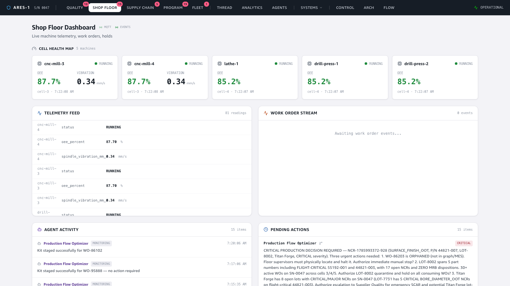

# Demo — Live Shop Floor: real-time SCADA telemetry → predictive maintenance

**Story:** most of the demo flows through the Kafka/EventBridge event backbone. The
shop floor is different: machine telemetry is **live 1 Hz MQTT**, streamed straight
from IoT Core to the browser and rendered on machine cards in real time. When a
reading crosses a threshold, an **IoT rule** lifts it onto the event backbone, where
the **Predictive Maintenance Coordinator** agent picks it up — closing the gap from
raw sensor signal to an actionable maintenance recommendation.

🎬 **Video:** [`video/scada-demo.mp4`](video/scada-demo.mp4) (continuous screen recording — watch the cards update live)

---

## 1. Live telemetry — the only real-time MQTT surface

The Shop Floor dashboard subscribes (browser-side, over MQTT-over-WSS with a
Cognito-attached IoT policy) to `aerospace/ares1/#`. Five machines stream OEE,
vibration, temperature, and cycle time at 1 Hz. The cards and the telemetry feed
**update live** — this is not polled REST, it's the sensor stream itself.



Note **cnc-mill-3**: spindle vibration is elevated to **2.6 mm/s** while the other
machines sit at their normal ~0.5 mm/s. The bearing is wearing.

## 2. Threshold breach → onto the event backbone

`gen_scada` publishes the climbing vibration. An **IoT topic rule**
(`SELECT … WHERE value > 1.8`) matches the breach and invokes the
`scada-event-forwarder` Lambda, which republishes it as a canonical
`PARAMETER_ANOMALY` event (domain `SCADA`) to MSK → EventBridge — the same backbone
every other system uses. This is the bridge from the MQTT world to the event world.

> **Flood control:** telemetry is 1 Hz, so a *sustained* fault would otherwise fire
> one agent invocation every second and exhaust the AgentCore session quota. The
> forwarder debounces with an atomic DynamoDB conditional write — **at most one
> anomaly event per machine per 5-minute cooldown**. A sustained breach produces one
> agent reaction, not a thousand.

## 3. The payoff — the Predictive Maintenance Coordinator reacts

The agent receives the single `PARAMETER_ANOMALY`, assesses it, and prepares a
maintenance recommendation for a human — its trace shows the whole hop, from the
EventBridge-delivered anomaly to the finding:


```
Agent Invoked       PARAMETER_ANOMALY · cnc-mill-3 · via eventbridge
Asked Human         "CRITICAL: cnc-mill-3 spindle vibration reached 2.8 mm/s —
                     IMMINENT BEARING FAILURE threshold exceeded. Authorize
                     immediate predictive maintenance?"
Finding Published   "IMMINENT FAILURE — cnc-mill-3 at 2.8 mm/s (56% above critical
                     threshold). Immediate maintenance intervention."
```

From a raw 1 Hz sensor reading to a human-authorizable maintenance decision —
through the same event backbone, with the agent firing **once**, not on every tick.

---

### How it was captured
`gen_scada` (live, ECS, eu-west-1) streams MQTT to IoT Core; the bearing-wear ramp on
cnc-mill-3 is toggled from Demo Control. The IoT rule → `scada-event-forwarder` Lambda
→ MSK `aerospace.scada.events` → MSK-Connect sink → EventBridge → agent path is all
live. The trace shown is a real single reaction (`corr 985b4e0c…`, 3 records), opened
via the dashboard's trace deep-link. Frontend run locally; driven with Playwright.

**Two fixes shipped to make this demo real:** (1) `aerospace.scada.events` was missing
from the MSK-Connect sink topic list, so SCADA anomalies never reached the agents —
added it. (2) The forwarder had no debounce, so a sustained fault flooded the agents
at 1 Hz — added the 5-minute per-machine cooldown.
