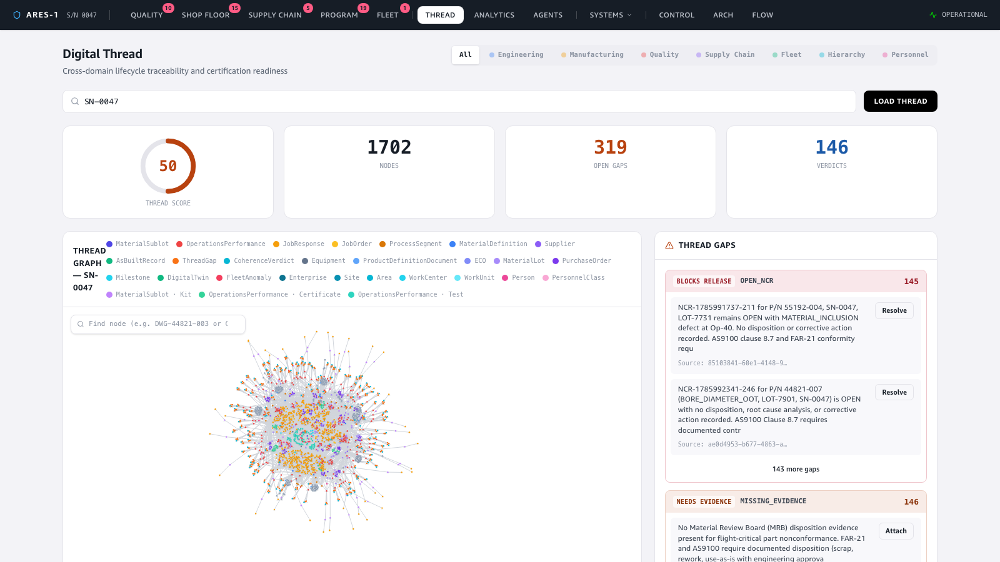
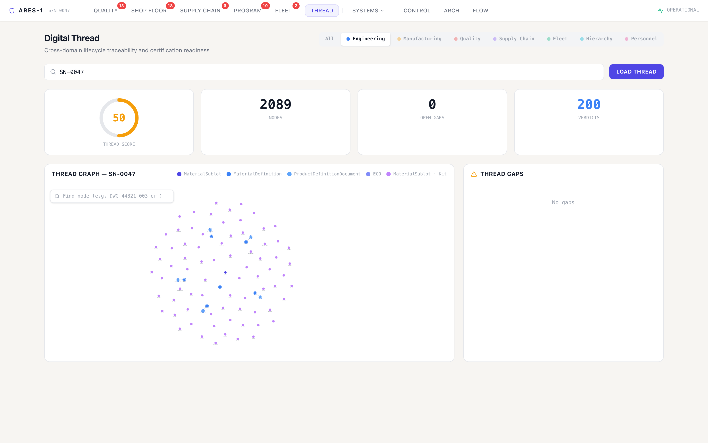
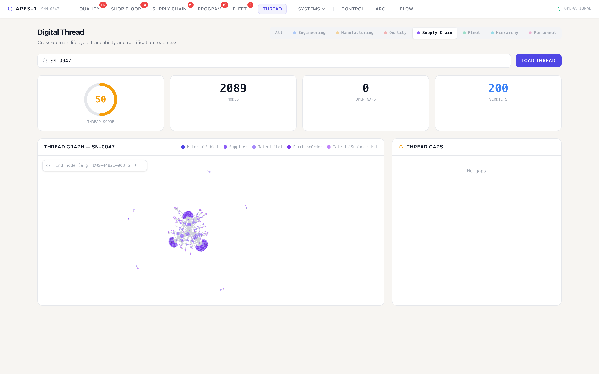
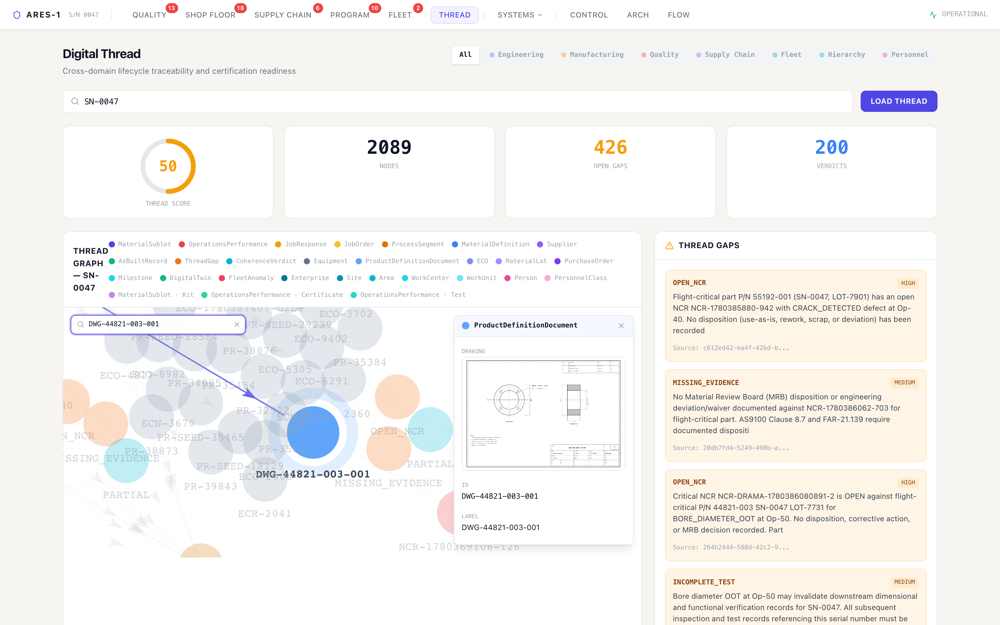

# Demo — The Digital Thread: one serial number, the whole lifecycle as a graph

**Story:** every event from every system is normalized to ISA-95 and written to a
**Neptune knowledge graph**. The result is a *digital thread*: for any serial number,
the complete cross-domain lifecycle — design → manufacturing → quality → supply chain
→ fleet — reconstructed as one connected graph. A separate **slow consumer** reasons
over that graph asynchronously and writes **certification-readiness** output:
*thread gaps* (what's missing for sign-off) and *coherence verdicts*.

Serial number in focus: **SN-0047** — **2,082 nodes** across 27 ISA-95 types.

🎬 **Video:** [`video/thread-demo.mp4`](video/thread-demo.mp4) (continuous screen recording)

---

## 1. The whole lifecycle, one graph

Loading the thread for SN-0047 renders the full graph: 2,082 nodes — JobOrders and
JobResponses (manufacturing), PurchaseOrders/Suppliers/GoodsReceipts (supply chain),
ECOs and drawings (engineering), FleetAnomalies and DigitalTwins (in-service), all
linked. The header tracks **thread score**, **node count**, **open gaps (426)**, and
**coherence verdicts (200)**.

## 2. Cross-domain — filter to one ISA-95 level

The domain filters refocus the graph onto a single ISA-95 domain. Engineering, for
example, isolates the `MaterialDefinition` / `ProductDefinitionDocument` / `ECO`
nodes — the as-designed view — and the legend narrows to match:

Supply Chain shows the procurement sub-thread (Suppliers, POs, Lots, Receipts):

## 3. Find any node — and see its evidence

The graph's node search jumps to any node by id/label/type. Searching the
flight-critical drawing `DWG-44821-003-001` selects and centres it, and the detail
panel renders the **actual drawing inline** — the same `ProductDefinitionDocument`
that the [drawing demo](../drawing-demo/README.md) and an agent's vision tool both
use. One node, structured properties + the unstructured artifact together:

## 4. Certification readiness — the slow consumer's output

The **Thread Gaps** panel (right) is not hand-authored — it's written by the
asynchronous certification-readiness agent running in the slow consumer, which reads
the graph and flags what stands between this serial number and sign-off:

- **OPEN_NCR** — flight-critical part with an open non-conformance, no disposition
- **MISSING_EVIDENCE** — no MRB disposition / corrective action for a CRITICAL NCR
  (cites FAR-21.130 conformity-inspection requirements)
- **INCOMPLETE_TEST** — bore-diameter OOT invalidates downstream dimensional records

Alongside the 426 gaps sit **200 CoherenceVerdicts** — the agent's structured
as-designed vs as-built vs as-maintained coherence assessments. This is the payoff of
the dual-consumer design: the fast consumer keeps the graph current in real time,
while the slow consumer reasons over it (via Bedrock) and writes verdicts separately,
never blocking ingestion.

---

### How it was captured
The graph is the live steady-state thread for SN-0047 in Neptune (eu-west-1), built by
the fast consumer from the normalized event stream; the gaps and verdicts are written
by the slow-consumer certification-readiness agent. No injection — this is the baseline
knowledge graph. Frontend run locally; driven with Playwright (continuous video + 2×
stills). The node-search and trace features used here are the same ones added during
the drawing and cascade demos.
