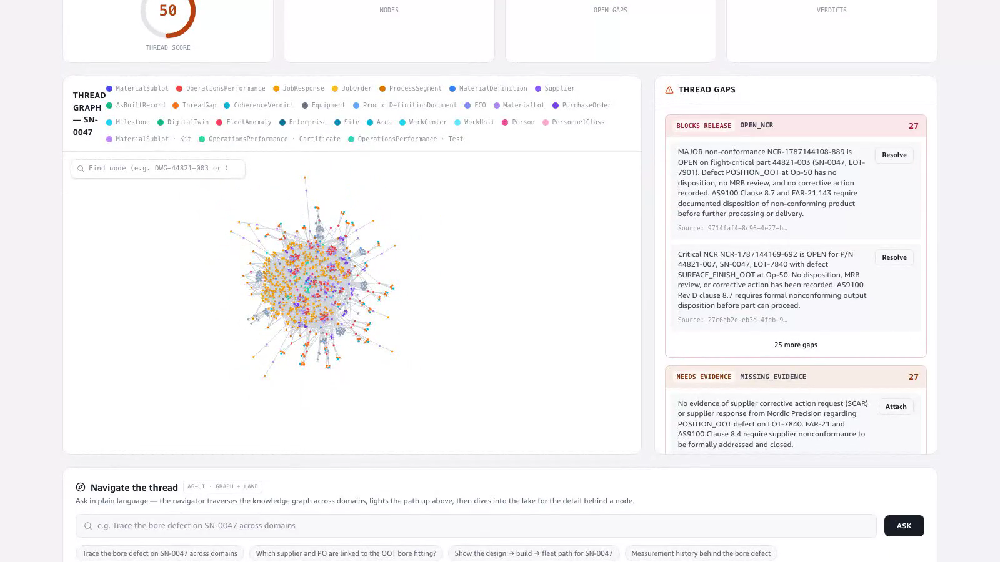
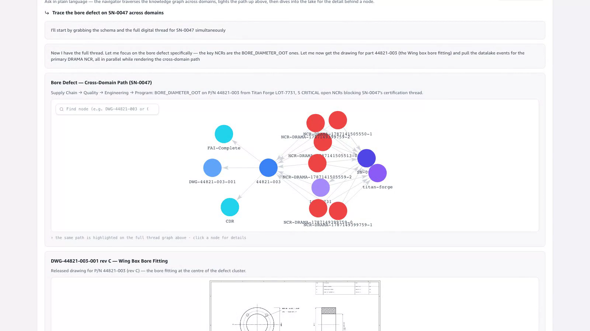
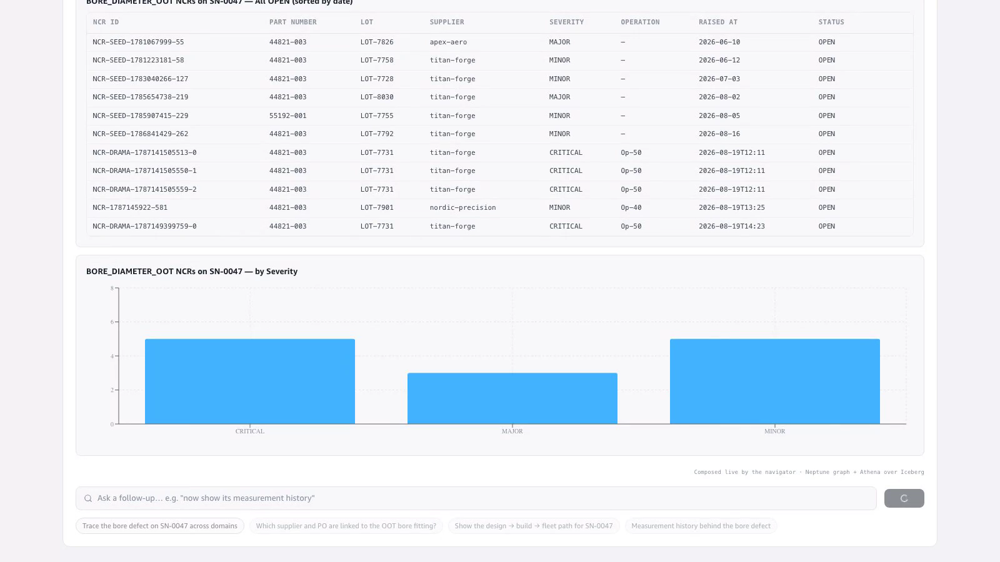
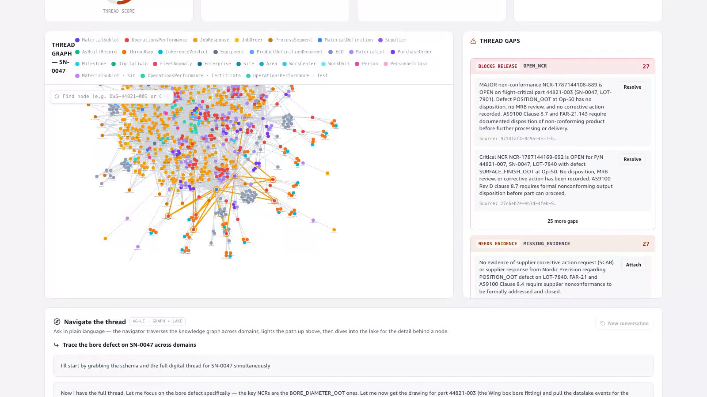

# Demo — Digital Thread Navigator (graph → drawing → lake)

**Story:** a conversational agent on the Digital Thread page **navigates the Neptune
knowledge graph across domains**, lights the cross-domain path up on the live graph,
shows the **PLM-published drawing** inline, then **dives into the S3 + Iceberg data
lake** for the detail behind a node — all streamed as graph-highlight + chart + table
+ prose **widgets** over the **AG-UI protocol** on Amazon Bedrock AgentCore Runtime.
The graph is the map; the lake is the detail; the graph grounds the SQL.

This is the graph-native counterpart to the [analytics agent](../agui-demo/README.md):
that one is lake-first text-to-SQL; this one traverses the thread and paints the path
on the map.

🎬 **Video:** [`video/thread-navigator-demo.mp4`](video/thread-navigator-demo.mp4) (~80 s, login-free)

Question asked: **"Trace the bore defect on SN-0047 across domains."**

---

## 1. Navigate — one question, the whole thread

The navigator console folds onto the Digital Thread page beneath the graph. The graph's
own node search (the entry point for the drawings demo) is unchanged.

## 2. The cross-domain path — as an interactive subgraph

The agent renders the traced path (Titan Forge → LOT-7731 → SN-0047 → P/N 44821-003 →
the CRITICAL `BORE_DIAMETER_OOT` NCRs → CDR) as an **interactive force-graph** — the same
rendering as the full thread graph above, with node labels and **click-for-details** —
and shows the released PLM drawing (DWG-44821-003-001 rev C) inline. The same path is lit
amber on the full graph above.

## 3. Dive — the lake behind the node

For the detail the graph doesn't hold, the agent runs Athena over Iceberg and renders
the NCR timeline as a table and the severity split as a chart.

## 4. The path, lit up on the live graph

`render_graph` highlights the exact traversed nodes on the force-graph — the amber
cross-domain path a viewer can see, not just a list of ids.

## Why it matters

The graph answers *how things connect across domains*; the lake answers *what the values
are*. One conversation crosses both, and real identifiers found in the graph ground every
lake query — the agent quotes only what the tools return, never an invented figure.

## Live evidence

- Runtime: `aerospace_thread_navigator` on Bedrock AgentCore Runtime (AGUI protocol),
  Cognito-authenticated, browser-direct SSE.
- Tools: `get_graph_schema`, `query_graph` (Gremlin over the IAM Neptune route),
  `query_datalake_sql` (Athena over Iceberg), plus the frontend widgets `render_graph`,
  `render_drawing`, `render_chart`, `render_table`.
- The graph's node search and drawing detail panel are preserved — the navigator adds an
  amber highlight layer on top, it does not replace them.
